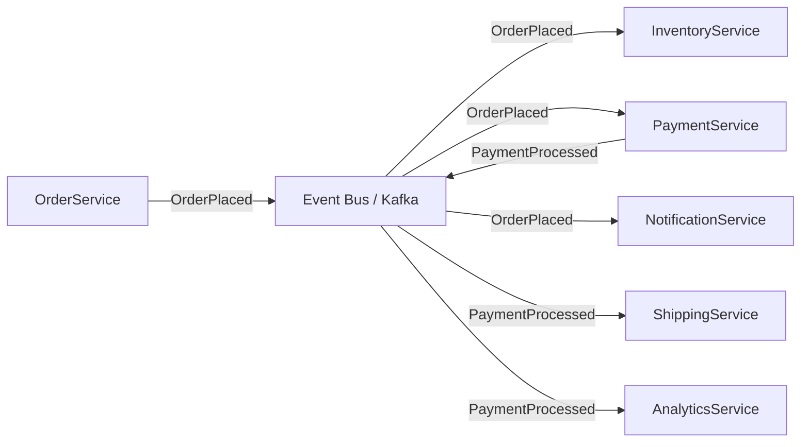

# 26. Event-Driven Architecture

> **Categoria:** Padrões Arquiteturais  
> **Nível:** Essencial para System Design de microservices  
> **Complexidade:** Alta

---

## Definição

**Event-Driven Architecture (EDA)** é um padrão arquitetural onde componentes se comunicam através de **eventos** — fatos imutáveis que representam algo que **aconteceu**. Em vez de chamadas síncronas diretas, serviços **publicam eventos** e outros serviços **reagem** a eles, promovendo **desacoplamento**, **escalabilidade** e **resiliência**.

---

## Por Que é Importante?

- **Padrão dominante em Big Techs** — Uber, Netflix, LinkedIn, Amazon
- **Habilita microservices verdadeiramente desacoplados** — serviços não conhecem uns aos outros
- **Escalabilidade independente** — cada consumidor escala conforme sua necessidade
- **Resiliência** — falha em um serviço não cascateia para outros
- **Pergunta frequente em entrevistas** de system design

---

## Diagrama de Arquitetura



```
Síncrono (REST):                    Event-Driven:
  
  Order ──req──▶ Payment            Order ──event──▶ [Event Bus]
  Order ──req──▶ Inventory                              │
  Order ──req──▶ Notification            ┌──────────────┼────────────┐
                                         ▼              ▼            ▼
  (Order CONHECE e DEPENDE              Payment    Inventory   Notification
   de cada serviço downstream)
                                    (Order NÃO conhece os consumers
                                     — total desacoplamento)
```

---

## Conceitos Fundamentais

### O que é um Evento?

```
Evento = Fato imutável que aconteceu no passado

Exemplos:
  OrderPlaced       ← algo aconteceu (passado)
  PaymentProcessed  ← fato consumado
  UserRegistered    ← estado mudou
  InventoryReserved ← ação completada

NÃO confundir com:
  CreateOrder       ← isso é um COMMAND (intenção, pode falhar)
  ProcessPayment    ← isso é um COMMAND
```

### Anatomia de um Evento

```json
{
  "event_id": "evt_abc123",
  "event_type": "OrderPlaced",
  "event_version": "1.2",
  "timestamp": "2024-01-15T10:30:00.000Z",
  "source": "order-service",
  "correlation_id": "corr_xyz789",
  "causation_id": "evt_prev456",
  "aggregate_id": "order-12345",
  "data": {
    "order_id": "order-12345",
    "customer_id": "cust-67890",
    "items": [
      {"product_id": "prod-111", "quantity": 2, "price": 29.99}
    ],
    "total": 59.98
  },
  "metadata": {
    "user_agent": "mobile-app/3.2",
    "ip": "192.168.1.1"
  }
}
```

### Tipos de Eventos

| Tipo | Descrição | Tamanho | Exemplo |
|------|-----------|---------|---------|
| **Notification Event** | Informa que algo aconteceu (sem dados) | Pequeno | `OrderPlaced { orderId }` |
| **Event-Carried State Transfer** | Carrega dados completos | Grande | `OrderPlaced { order: { ... } }` |
| **Domain Event** | Mudança de estado no domínio | Médio | `InventoryReserved { items, quantities }` |
| **Integration Event** | Para comunicação entre bounded contexts | Médio | `PaymentCompleted { orderId, amount }` |

---

## Modelos de Entrega

### 1. Event Notification

```
Producer publica que algo aconteceu; consumer decide o que fazer:

  OrderService ──"OrderPlaced(orderId=123)"──▶ Kafka
  
  InventoryService: 
    → recebe evento
    → consulta Order API para obter detalhes
    → reserva estoque
    
  Prós: Eventos pequenos, desacoplado
  Contras: Consumer precisa fazer query adicional (N+1)
```

### 2. Event-Carried State Transfer (ECST)

```
Evento carrega TODOS os dados necessários:

  OrderService ──"OrderPlaced({order: {items, total, ...}})"──▶ Kafka
  
  InventoryService:
    → recebe evento COM dados completos
    → reserva estoque diretamente (sem queries adicionais)
    
  Prós: Consumer autossuficiente, sem dependência do producer
  Contras: Eventos maiores, potencial duplicação de dados
```

### 3. Event Sourcing (armazena eventos como source of truth)

```
Em vez de estado final, armazena TODOS os eventos:

  Event Store:
    1. OrderCreated { orderId, customerId, items }
    2. PaymentReceived { orderId, amount }
    3. ItemShipped { orderId, trackingId }
    
  Estado atual = replay de todos os eventos
  
  (Ver tópico 28 - Event Sourcing para detalhes)
```

---

## Topologias

### Mediator Topology

```
                    ┌──────────────┐
                    │   Mediator   │  (Orchestrator)
                    │  (Conductor/ │
                    │   Step Func) │
                    └──────┬───────┘
                           │
              ┌────────────┼────────────┐
              ▼            ▼            ▼
         ┌────────┐  ┌────────┐  ┌────────┐
         │ Queue1 │  │ Queue2 │  │ Queue3 │
         └───┬────┘  └───┬────┘  └───┬────┘
             ▼            ▼            ▼
         Processor1  Processor2  Processor3

Fluxo:
1. Evento inicial → Mediator
2. Mediator orquestra a ordem de processamento
3. Cada step pode gerar novos eventos
4. Mediator gerencia compensações em caso de falha

Quando usar:
- Workflows complexos com muitos steps
- Necessidade de coordenação e ordering
- Error handling centralizado
```

### Broker Topology

```
  Producer1 ──event──▶ ┌──────────┐ ──▶ Consumer1
  Producer2 ──event──▶ │  Broker   │ ──▶ Consumer2
  Producer3 ──event──▶ │ (Kafka/   │ ──▶ Consumer3
                       │  RabbitMQ)│ ──▶ Consumer4
                       └──────────┘

Fluxo:
1. Producers publicam eventos no broker
2. Consumers se inscrevem em tópicos
3. Cada consumer processa independentemente
4. Sem coordenação central

Quando usar:
- Fluxos simples, desacoplados
- Alta escalabilidade necessária
- Sem necessidade de coordenação central
```

---

## Patterns Essenciais

### Idempotent Consumer

```
Problema: eventos podem ser entregues MAIS DE UMA VEZ (at-least-once).

Solução: consumer DEVE ser idempotente.

  Processed Events Table:
  ┌─────────────────┬────────────────┐
  │ event_id        │ processed_at   │
  ├─────────────────┼────────────────┤
  │ evt_abc123      │ 2024-01-15     │
  │ evt_def456      │ 2024-01-15     │
  └─────────────────┴────────────────┘

  Consumer:
  1. Recebe evento evt_abc123
  2. Verifica: já processado? → SIM → skip
  3. Processa e registra na tabela
  4. Tudo na MESMA transação DB (atômico)
```

### Dead Letter Queue (DLQ)

```
Problema: evento não pode ser processado (dados inválidos, bug).

  Main Queue ──▶ Consumer ──FALHA──▶ Retry (3x)
                                          │
                                     Ainda falha
                                          │
                                          ▼
                                    ┌──────────┐
                                    │   DLQ    │
                                    │ (Dead    │
                                    │  Letter) │
                                    └──────────┘
                                          │
                                    Alerting + Manual review
```

### Event Ordering

```
Problema: eventos fora de ordem podem causar inconsistências.

  OrderPlaced → PaymentProcessed → OrderCancelled
  
  Se consumer recebe: PaymentProcessed → OrderPlaced → OrderCancelled
  → Estado inconsistente!

Soluções:
1. Kafka: ordering por partition key (ex: orderId)
   - Todos os eventos do mesmo order → mesma partition → mesma ordem
   
2. Sequence number no evento:
   - Consumer rejeita se sequence < expected
   - Bufferiza eventos fora de ordem até receber os anteriores

3. Event version/timestamp:
   - Aplica apenas se version > current
```

### Correlation & Causation

```
Trace de eventos relacionados:

  Request: "Create Order"
  
  evt_1: OrderCreated     (correlation: req_123, causation: null)
    └── evt_2: PaymentCharged  (correlation: req_123, causation: evt_1)
         └── evt_3: InventoryReserved (correlation: req_123, causation: evt_2)
              └── evt_4: ShipmentCreated (correlation: req_123, causation: evt_3)

  Correlation ID: agrupa todos os eventos do mesmo fluxo
  Causation ID: indica qual evento CAUSOU este evento
  
  → Permite tracing distribuído e debugging
```

---

## Implementação com Kafka

### Producer (Spring Boot)

```java
@Service
public class OrderEventPublisher {
    
    private final KafkaTemplate<String, OrderEvent> kafkaTemplate;
    
    public void publishOrderPlaced(Order order) {
        OrderPlacedEvent event = OrderPlacedEvent.builder()
            .eventId(UUID.randomUUID().toString())
            .eventType("OrderPlaced")
            .timestamp(Instant.now())
            .orderId(order.getId())
            .customerId(order.getCustomerId())
            .items(order.getItems())
            .total(order.getTotal())
            .build();
        
        // Partition key = orderId → garante ordering por order
        kafkaTemplate.send("orders", order.getId(), event);
    }
}
```

### Consumer (Spring Boot)

```java
@Component
public class InventoryEventConsumer {
    
    private final InventoryService inventoryService;
    private final ProcessedEventRepository processedEvents;
    
    @KafkaListener(topics = "orders", groupId = "inventory-service")
    @Transactional
    public void handleOrderPlaced(OrderPlacedEvent event) {
        // Idempotency check
        if (processedEvents.existsByEventId(event.getEventId())) {
            log.info("Event already processed: {}", event.getEventId());
            return;
        }
        
        // Process
        inventoryService.reserveItems(event.getOrderId(), event.getItems());
        
        // Mark as processed
        processedEvents.save(new ProcessedEvent(event.getEventId()));
        
        // Publish downstream event
        eventPublisher.publish(new InventoryReservedEvent(event.getOrderId()));
    }
}
```

---

## Benefícios vs Desafios

| Benefício | Desafio |
|-----------|---------|
| **Desacoplamento** — services não se conhecem | **Debugging complexo** — trace distribuído necessário |
| **Escalabilidade** — consumers escalam independente | **Eventual consistency** — dados não são imediatos |
| **Resiliência** — falha isolada, retry automático | **Ordering** — garantir ordem entre serviços |
| **Extensibilidade** — adicionar consumer = zero mudança no producer | **Schema evolution** — eventos mudam ao longo do tempo |
| **Audit trail** — eventos são log natural | **Monitoring** — end-to-end visibility é complexo |
| **Time decoupling** — producer e consumer não precisam estar online ao mesmo tempo | **Testing** — testes de integração mais complexos |

---

## Event Schema Evolution

```
Problema: schema do evento MUDA ao longo do tempo.

  V1: OrderPlaced { orderId, items, total }
  V2: OrderPlaced { orderId, items, total, couponCode }  ← novo campo
  V3: OrderPlaced { orderId, lineItems, total, couponCode }  ← rename

Estratégias:

1. Schema Registry (Confluent):
   - Valida compatibilidade (backward, forward, full)
   - Consumers antigos leem eventos novos (backward compat)
   
2. Event versioning:
   - event_type: "OrderPlaced.v2"
   - Consumer suporta múltiplas versões
   
3. Upcasting:
   - Transforma evento antigo no formato novo no consumer
   - V1 → adapter → V2 format
```

---

## Uso em Big Techs

| Empresa | Event Bus | Uso | Detalhes |
|---------|-----------|-----|----------|
| **LinkedIn** | Apache Kafka | "Sistema nervoso central" | Criaram Kafka; trilhões de eventos/dia |
| **Uber** | Apache Kafka | Trip lifecycle | OrderRequested → DriverAssigned → TripStarted → TripCompleted |
| **Netflix** | Apache Kafka | Telemetria + recommendations | Event sourcing de viewing events |
| **Amazon** | EventBridge + SQS/SNS | Tudo | AWS nativo para inter-service events |
| **Stripe** | Kafka + custom | Payment webhooks | Eventos para integrators (checkout.session.completed) |
| **Shopify** | Kafka | Commerce events | OrderCreated, PaymentProcessed, FulfillmentCreated |
| **Spotify** | Pub/Sub + Kafka | Listening events | Event-driven recommendations pipeline |

### Uber Trip Lifecycle

```
Event-Driven Trip Flow:

  Driver opens app → DriverOnline
  Rider requests ride → RideRequested
  
  ┌──────────────┐
  │ RideRequested │
  └──────┬───────┘
         │
  ┌──────▼───────┐     ┌───────────────┐
  │MatchingService│────▶│DriverAssigned │
  └──────────────┘     └──────┬────────┘
                              │
                       ┌──────▼────────┐
                       │DriverArrived  │
                       └──────┬────────┘
                              │
                       ┌──────▼────────┐
                       │ TripStarted   │
                       └──────┬────────┘
                              │
                       ┌──────▼────────┐
                       │TripCompleted  │──▶ PaymentService
                       └──────┬────────┘──▶ ReceiptService
                              │            ──▶ AnalyticsService
                              │            ──▶ RatingService
                       ┌──────▼────────┐
                       │PaymentCharged │
                       └───────────────┘
```

---

## Perguntas Frequentes em Entrevistas

1. **"O que é Event-Driven Architecture?"**
   - Serviços se comunicam via eventos (fatos imutáveis)
   - Producers publicam, consumers reagem
   - Desacoplamento total via event bus (Kafka, RabbitMQ)

2. **"Qual a diferença entre Evento e Comando?"**
   - Evento: fato passado (`OrderPlaced`) — pode ter múltiplos consumers
   - Comando: intenção (`CreateOrder`) — um handler específico

3. **"Como garantir ordering?"**
   - Kafka: partition key (eventos do mesmo aggregate → mesma partition)
   - Sequence numbers no evento
   - Consumir eventi in-order por aggregate, não globalmente

4. **"Como lidar com falhas?"**
   - Retry com exponential backoff
   - DLQ para eventos que falharam múltiplas vezes
   - Idempotent consumers (deduplicação por event_id)

5. **"Qual a diferença entre EDA e microservices com REST?"**
   - REST: síncrono, acoplado temporalmente, request-response
   - EDA: assíncrono, desacoplado, event-driven
   - EDA escala melhor e é mais resiliente, mas mais complexo

---

## Referências

- Martin Fowler — *"What do you mean by Event-Driven?"*
- Chris Richardson — *"Microservices Patterns"*, Cap. Event-Driven Architecture
- Jay Kreps — *"The Log: What every software engineer should know about real-time data's unifying abstraction"*
- Ben Stopford — *"Designing Event-Driven Systems"* (Confluent)
- Uber Engineering Blog — *"Uber's Real-Time Push Platform"*
- Netflix Tech Blog — *"Evolution of the Netflix Data Pipeline"*
