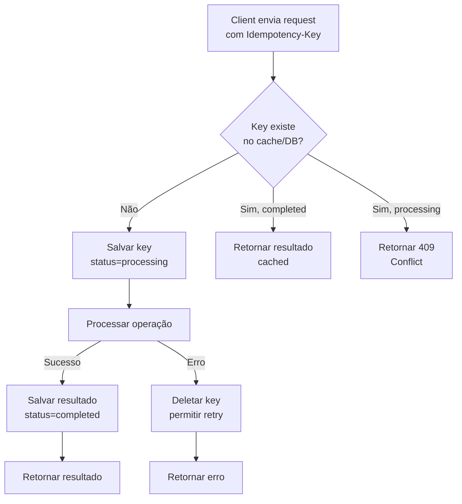

# 34. Idempotency

> **Categoria:** Fundamentos e Building Blocks  
> **Nível:** Essencial para sistemas distribuídos confiáveis  
> **Complexidade:** Média

---

## Definição

**Idempotência** é a propriedade de uma operação onde **executá-la múltiplas vezes produz o mesmo resultado** que executá-la uma única vez. Em sistemas distribuídos, onde retries são inevitáveis (network failures, timeouts), idempotência garante que operações duplicadas não causem **efeitos colaterais indesejados** (cobranças duplicadas, mensagens duplicadas, etc.).

---

## Por Que é Importante?

- **Redes são unreliable** — requests podem ser duplicados (retry após timeout)
- **At-least-once delivery** — mensageria pode entregar a mesma mensagem 2x
- **Pagamentos** — cobrar 2x é inaceitável → Stripe, PayPal, Amazon exigem idempotência
- **Microservices** — retries são padrão em comunicação inter-serviços
- **Pergunta frequente** — "como garantir que essa operação não executa 2 vezes?"

---

## Operações Naturalmente Idempotentes

```
✅ Naturalmente idempotentes (repetir é safe):
  GET  /users/123           → Leitura, sem side effects
  PUT  /users/123 {name:"A"}→ Sempre seta o MESMO valor  
  DELETE /users/123         → Deletar 2x = user continua deletado

❌ NÃO idempotentes por natureza:
  POST /orders              → Cada chamada cria um ORDER NOVO
  POST /payments            → Cada chamada cobra NOVAMENTE
  POST /messages            → Cada chamada envia OUTRA mensagem
  PATCH /accounts/balance   → Incremento: saldo += 100 (2x = +200!)
```

### Exemplo Visual do Problema

```
Cenário: Client faz pagamento, timeout na resposta

  Client ──POST /pay $100──▶ Payment Service
                                  │
                              Processa ✅ (cobra $100)
                                  │
  Client ◀──── TIMEOUT ────────── │ (response perdida na rede)
  
  Client retenta (retry):
  Client ──POST /pay $100──▶ Payment Service
                                  │
                              Processa ✅ (cobra $100 NOVAMENTE!)
                              
  Resultado: Cliente cobrado $200! 💀

  Com idempotência:
  Client ──POST /pay $100──▶ Payment Service
           idempotency_key:      │
           "abc-123"         Processa ✅ (cobra $100)
                             Salva: abc-123 → completed
                                  │
  Client ◀──── TIMEOUT ──────────│
  
  Client retenta:
  Client ──POST /pay $100──▶ Payment Service
           idempotency_key:      │
           "abc-123"         Lookup: abc-123 → JÁ PROCESSADO
                             Retorna resultado anterior ✅
                             NÃO cobra novamente
  
  Resultado: Cliente cobrado $100 (correto!) ✅
```

---

## Padrões de Implementação

### 1. Idempotency Key (mais comum)

```
Client envia um ID único por operação; server usa como dedup key.

  ┌────────────────────────────────────────────────────────┐
  │  POST /api/payments                                     │
  │  Headers:                                               │
  │    Idempotency-Key: "550e8400-e29b-41d4-a716-446655440000"│
  │  Body:                                                  │
  │    { "amount": 100, "currency": "BRL" }                │
  └────────────────────────────────────────────────────────┘
  
  Server Flow:
  
  ┌──────────────────────────────────────────────────┐
  │  1. Recebe request com idempotency_key            │
  │  2. Lookup no DB: key existe?                     │
  │     ├── SIM + status=completed → retorna cached   │
  │     ├── SIM + status=processing → retorna 409     │
  │     └── NÃO → INSERT key com status=processing    │
  │  3. Processa operação                             │
  │  4. UPDATE key: status=completed, response=result │
  │  5. Retorna resultado                             │
  └──────────────────────────────────────────────────┘
```

**Implementação em Python (FastAPI):**

```python
from fastapi import FastAPI, Header, HTTPException
from uuid import UUID
import redis
import json

app = FastAPI()
cache = redis.Redis()

IDEMPOTENCY_TTL = 86400  # 24 horas

@app.post("/api/payments")
async def create_payment(
    payment: PaymentRequest,
    idempotency_key: str = Header(..., alias="Idempotency-Key")
):
    # 1. Check if key already processed
    cached = cache.get(f"idemp:{idempotency_key}")
    if cached:
        result = json.loads(cached)
        if result["status"] == "processing":
            raise HTTPException(409, "Request already in progress")
        return result["response"]  # Return cached response
    
    # 2. Mark as processing (with TTL to prevent leaks)
    cache.setex(
        f"idemp:{idempotency_key}",
        IDEMPOTENCY_TTL,
        json.dumps({"status": "processing"})
    )
    
    try:
        # 3. Process payment
        result = await process_payment(payment)
        
        # 4. Cache result
        cache.setex(
            f"idemp:{idempotency_key}",
            IDEMPOTENCY_TTL,
            json.dumps({"status": "completed", "response": result})
        )
        return result
    except Exception as e:
        # 5. Clean up on failure (allow retry)
        cache.delete(f"idemp:{idempotency_key}")
        raise
```

**Implementação em Go:**

```go
func PaymentHandler(w http.ResponseWriter, r *http.Request) {
    idempKey := r.Header.Get("Idempotency-Key")
    if idempKey == "" {
        http.Error(w, "Idempotency-Key required", 400)
        return
    }

    // Check cache
    cached, err := redis.Get(ctx, "idemp:"+idempKey).Result()
    if err == nil {
        var result IdempResult
        json.Unmarshal([]byte(cached), &result)
        if result.Status == "processing" {
            http.Error(w, "Request in progress", 409)
            return
        }
        json.NewEncoder(w).Encode(result.Response)
        return
    }

    // Mark processing
    redis.SetEX(ctx, "idemp:"+idempKey, 
        `{"status":"processing"}`, 24*time.Hour)

    // Process
    result, err := processPayment(r)
    if err != nil {
        redis.Del(ctx, "idemp:"+idempKey)
        http.Error(w, err.Error(), 500)
        return
    }

    // Cache result
    payload, _ := json.Marshal(IdempResult{
        Status:   "completed",
        Response: result,
    })
    redis.SetEX(ctx, "idemp:"+idempKey, payload, 24*time.Hour)
    json.NewEncoder(w).Encode(result)
}
```

### 2. Conditional Updates (Optimistic Locking)

```
Usa version/ETag para garantir que update só aplica uma vez:

  -- Leitura
  SELECT balance, version FROM accounts WHERE id = 123;
  -- Retorna: balance=1000, version=5

  -- Update condicional
  UPDATE accounts 
  SET balance = balance - 100, version = version + 1
  WHERE id = 123 AND version = 5;  -- ← só executa se version = 5!

  -- Se retry:
  UPDATE accounts 
  SET balance = balance - 100, version = version + 1
  WHERE id = 123 AND version = 5;  -- ← version agora é 6 → 0 rows affected!

  ✅ Sem lock pessimista
  ✅ Naturalmente idempotente
  ❌ Precisa de retry logic no client
```

### 3. Deduplication Table

```
Tabela específica para tracking de operações processadas:

  CREATE TABLE processed_operations (
      operation_id  VARCHAR(36) PRIMARY KEY,  -- UUID do client
      operation_type VARCHAR(50),
      result        JSONB,
      created_at    TIMESTAMP DEFAULT NOW(),
      expires_at    TIMESTAMP
  );

  -- No handler:
  BEGIN;
    -- Tenta inserir (falha se já existe)
    INSERT INTO processed_operations (operation_id, operation_type)
    VALUES ('abc-123', 'payment')
    ON CONFLICT (operation_id) DO NOTHING;
    
    -- Se inseriu (1 row affected) → processar
    -- Se não inseriu (0 rows) → retornar resultado existente
  COMMIT;
```

### 4. Natural Idempotency (SET ao invés de INCREMENT)

```
Transformar operações não-idempotentes em idempotentes:

  ❌ NÃO idempotente:
  UPDATE accounts SET balance = balance + 100 WHERE id = 123;
  -- Executar 2x = +200!

  ✅ Idempotente (com estado absoluto):
  UPDATE accounts SET balance = 1100 WHERE id = 123;
  -- Executar 2x = balance é 1100 (sempre o mesmo)

  ❌ NÃO idempotente:
  INSERT INTO messages (chat_id, text) VALUES (1, 'hello');
  -- Executar 2x = 2 mensagens!

  ✅ Idempotente (com unique constraint):
  INSERT INTO messages (message_id, chat_id, text) 
  VALUES ('uuid-1', 1, 'hello')
  ON CONFLICT (message_id) DO NOTHING;
  -- Executar 2x = 1 mensagem
```

---

## Fluxo Completo: API Idempotente



---

## Idempotência em Messaging

```
Problema: Consumer recebe a MESMA mensagem 2x (at-least-once delivery)

  Kafka:
    Partition 0: [msg1, msg2, msg3, msg4, msg5]
                                       ▲
                                  consumer offset: 3
    
    Consumer processa msg4, commit offset falha
    Consumer reinicia → lê msg4 NOVAMENTE (duplicada!)

  Soluções:

  1. Exactly-once semantics (Kafka):
     enable.idempotence=true (producer)
     isolation.level=read_committed (consumer)
     → Kafka deduplica internamente via PID + sequence number

  2. Consumer-side deduplication:
     Cada message tem um message_id
     Consumer mantém set de IDs processados
     → Skip se message_id já visto

  3. Idempotent handler:
     Handler é naturalmente idempotente
     → Processar 2x = mesmo efeito
     Ex: "SET user.status = ACTIVE" é idempotente
```

---

## Trade-offs

| Aspecto | Sem Idempotência | Com Idempotência |
|---------|:----------------:|:----------------:|
| **Complexidade** | 🟢 Simples | 🟡 Moderada |
| **Storage extra** | 🟢 Nenhum | 🔴 Dedup table/cache |
| **Latência** | 🟢 Menor | 🟡 +1 lookup |
| **Confiabilidade** | 🔴 Duplicatas possíveis | 🟢 At-most-once execution |
| **Retries** | 🔴 Perigosos | 🟢 Safe |
| **Pagamentos** | 🔴 Double charge! | 🟢 Cobrado 1x |

---

## Uso em Big Techs

| Empresa | Implementação | Detalhes |
|---------|--------------|----------|
| **Stripe** | `Idempotency-Key` header | Keys válidas por 24h; retorna cached response |
| **Amazon** | `ClientToken` em APIs | Idempotent creates em EC2, S3, DynamoDB |
| **Google** | `requestId` parameter | Cloud APIs suportam request deduplication |
| **PayPal** | `PayPal-Request-Id` | Mandatory para payment creation |
| **Square** | `idempotency_key` | Required para todas as mutations |
| **Shopify** | `X-Shopify-Idempotency-Key` | Protected webhooks |

### Stripe — Exemplo Real

```
# Stripe: Idempotency-Key é OBRIGATÓRIO para charges

curl https://api.stripe.com/v1/charges \
  -u sk_test_xxx: \
  -H "Idempotency-Key: KG5LxwFBepaK" \
  -d amount=2000 \
  -d currency=usd \
  -d source=tok_visa

# Retry com o MESMO key → retorna o MESMO charge
# Key válida por 24 horas
# Após 24h, mesma key pode criar novo charge

# Stripe internamente:
# 1. Salva key → Redis
# 2. Se key existe + completed → retorna cached
# 3. Se key existe + processing → retorna 409
# 4. Se key não existe → processa e salva resultado
```

---

## Perguntas Frequentes em Entrevistas

1. **"O que é idempotência e por que é importante?"**
   - Mesma operação executada N vezes = mesmo resultado que 1 vez
   - Essencial para retries em sistemas distribuídos (network failures)

2. **"Como implementar uma API de pagamento idempotente?"**
   - Client gera UUID (idempotency key)
   - Server faz lookup antes de processar
   - Se já processado → retorna cached result
   - Se em processamento → retorna 409

3. **"PUT é idempotente? POST é idempotente?"**
   - PUT: sim (SET absoluto), POST: não (cria novo recurso)
   - DELETE: sim (deletar 2x = recurso continua deletado)
   - GET: sim (nenhum side effect)

4. **"E se o server crashar entre processar e salvar o resultado?"**
   - Key fica como "processing" → timeout expira → client retenta
   - Usar transação: operação + save result no mesmo commit
   - Ou aceitar window de inconsistência com TTL

5. **"Idempotência vs Exactly-once delivery?"**
   - Exactly-once: infraestrutura garante (Kafka acks)
   - Idempotência: aplicação garante (handler é safe para retries)
   - Na prática: at-least-once + idempotent handler = effectively once

---

## Referências

- Stripe Docs — *"Idempotent Requests"* — stripe.com/docs/api/idempotent_requests
- Amazon Builders Library — *"Making retries safe with idempotent APIs"*
- Martin Kleppmann — *"Designing Data-Intensive Applications"*, Cap. 11: Stream Processing
- Pat Helland — *"Idempotence Is Not a Medical Condition"* — ACM Queue
- Kafka Docs — *"Exactly Once Semantics"*
- Google Cloud — *"Designing for Idempotency"*
