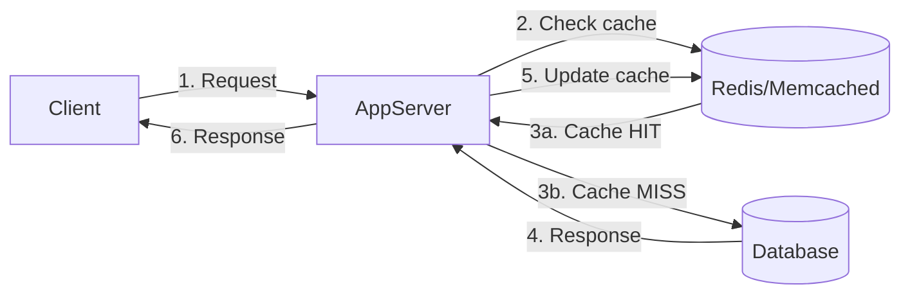
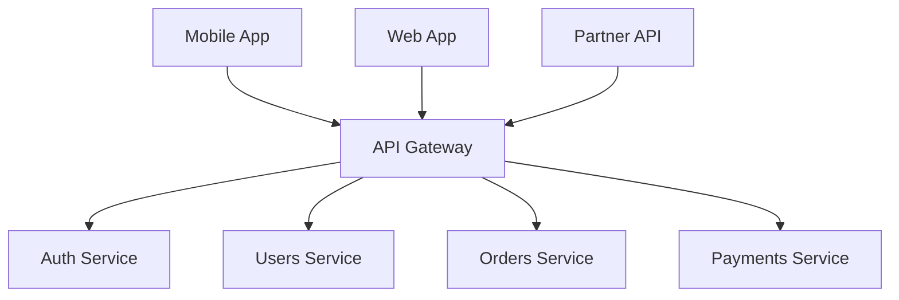
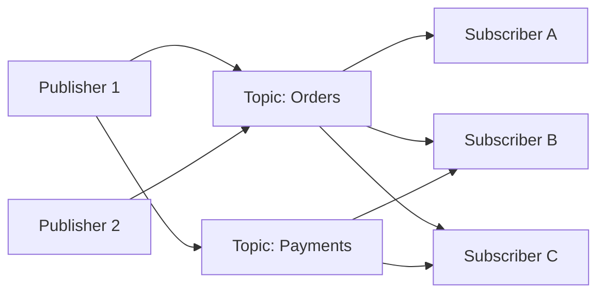
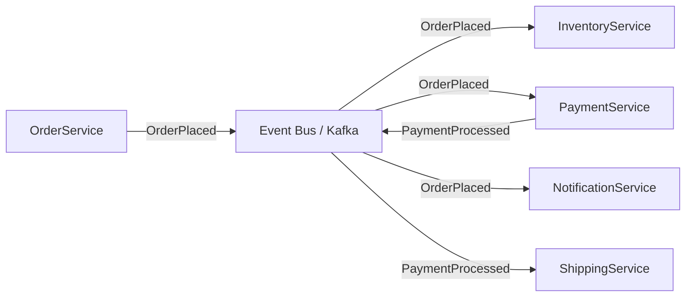

# System Design — 50 Conceitos Essenciais (Nível Big Tech)

> **Objetivo deste documento:** Servir como referência técnica abrangente sobre os **50 conceitos de System Design mais cobrados** em entrevistas e projetos de Big Techs (Google, Meta, Amazon, Netflix, Microsoft, Uber, Stripe, etc.).
> Cada tópico inclui descrição, diagrama, componentes-chave, trade-offs e exemplos reais.
>
> **Público-alvo:** Engenheiros preparando-se para entrevistas de System Design ou arquitetando sistemas distribuídos em produção.

---

## Sumário

- [System Design — 50 Conceitos Essenciais (Nível Big Tech)](#system-design--50-conceitos-essenciais-nível-big-tech)
  - [Sumário](#sumário)
  - [Parte I — Fundamentos e Building Blocks](#parte-i--fundamentos-e-building-blocks)
    - [1. Load Balancing](#1-load-balancing)
    - [2. Caching](#2-caching)
    - [3. CDN (Content Delivery Network)](#3-cdn-content-delivery-network)
    - [4. DNS (Domain Name System)](#4-dns-domain-name-system)
    - [5. Reverse Proxy](#5-reverse-proxy)
    - [6. API Gateway](#6-api-gateway)
    - [7. Database Indexing](#7-database-indexing)
    - [8. Database Replication](#8-database-replication)
    - [9. Database Sharding](#9-database-sharding)
    - [10. SQL vs NoSQL](#10-sql-vs-nosql)
    - [11. CAP Theorem](#11-cap-theorem)
    - [12. ACID vs BASE](#12-acid-vs-base)
    - [13. Consistent Hashing](#13-consistent-hashing)
    - [14. Message Queues](#14-message-queues)
    - [15. Pub/Sub (Publish-Subscribe)](#15-pubsub-publish-subscribe)
    - [16. Rate Limiting e Throttling](#16-rate-limiting-e-throttling)
    - [17. Circuit Breaker](#17-circuit-breaker)
    - [18. Service Discovery](#18-service-discovery)
    - [19. Heartbeat e Health Checks](#19-heartbeat-e-health-checks)
    - [20. Leader Election](#20-leader-election)
    - [21. Consensus Algorithms (Raft / Paxos)](#21-consensus-algorithms-raft--paxos)
    - [22. Gossip Protocol](#22-gossip-protocol)
    - [23. Bloom Filters](#23-bloom-filters)
    - [24. WebSockets / Long Polling / SSE](#24-websockets--long-polling--sse)
    - [25. REST vs GraphQL vs gRPC](#25-rest-vs-graphql-vs-grpc)
  - [Parte II — Padrões Arquiteturais](#parte-ii--padrões-arquiteturais)
    - [26. Event-Driven Architecture](#26-event-driven-architecture)
    - [27. CQRS (Command Query Responsibility Segregation)](#27-cqrs-command-query-responsibility-segregation)
    - [28. Event Sourcing](#28-event-sourcing)
    - [29. Saga Pattern](#29-saga-pattern)
    - [30. Outbox Pattern](#30-outbox-pattern)
    - [31. Back-of-the-Envelope Estimation](#31-back-of-the-envelope-estimation)
    - [32. Data Partitioning Strategies](#32-data-partitioning-strategies)
    - [33. Replication Strategies](#33-replication-strategies)
    - [34. Idempotency](#34-idempotency)
    - [35. OAuth 2.0 / JWT / Autenticação](#35-oauth-20--jwt--autenticação)
  - [Parte III — Designs Clássicos de Big Tech](#parte-iii--designs-clássicos-de-big-tech)
    - [36. URL Shortener (TinyURL)](#36-url-shortener-tinyurl)
    - [37. Pastebin](#37-pastebin)
    - [38. Twitter / X — Social Feed](#38-twitter--x--social-feed)
    - [39. Instagram — Photo Sharing](#39-instagram--photo-sharing)
    - [40. WhatsApp / Messenger — Chat System](#40-whatsapp--messenger--chat-system)
    - [41. YouTube / Netflix — Video Streaming](#41-youtube--netflix--video-streaming)
    - [42. Uber / Lyft — Ride Sharing](#42-uber--lyft--ride-sharing)
    - [43. Google Maps — Navigation](#43-google-maps--navigation)
    - [44. Dropbox / Google Drive — File Storage](#44-dropbox--google-drive--file-storage)
    - [45. Google Docs — Collaborative Editing](#45-google-docs--collaborative-editing)
    - [46. Typeahead / Autocomplete](#46-typeahead--autocomplete)
    - [47. Web Crawler](#47-web-crawler)
    - [48. Notification System](#48-notification-system)
    - [49. Payment System (Stripe-like)](#49-payment-system-stripe-like)
    - [50. Distributed Key-Value Store](#50-distributed-key-value-store)
  - [Referência Rápida — Mapa de Decisão](#referência-rápida--mapa-de-decisão)
  - [Números que Você Deve Saber](#números-que-você-deve-saber)
  - [Referências](#referências)

---

## Parte I — Fundamentos e Building Blocks

---

### 1. Load Balancing

**O que é:** Distribui tráfego de rede entre múltiplos servidores para garantir alta disponibilidade e performance.

```
              ┌─────────────┐
              │   Clients   │
              └──────┬──────┘
                     │
              ┌──────▼──────┐
              │Load Balancer │
              └──┬───┬───┬──┘
                 │   │   │
          ┌──────▼┐ ┌▼────┐ ┌▼──────┐
          │Server1│ │Srv 2│ │Server3│
          └───────┘ └─────┘ └───────┘
```

**Algoritmos Principais:**

| Algoritmo | Descrição | Quando Usar |
|-----------|-----------|-------------|
| **Round Robin** | Distribui sequencialmente | Servidores homogêneos |
| **Weighted Round Robin** | Peso proporcional à capacidade | Servidores heterogêneos |
| **Least Connections** | Envia para quem tem menos conexões | Requisições com duração variável |
| **IP Hash** | Hash do IP do cliente → servidor fixo | Sticky sessions |
| **Consistent Hashing** | Ring hash | Cache distribuído |

**Tipos:**

- **L4 (Transport):** Decisão por IP/porta (TCP/UDP). Mais rápido, menor overhead.
- **L7 (Application):** Decisão por conteúdo HTTP (headers, URL, cookies). Mais flexível.

**Tecnologias Reais:**
- **Hardware:** F5 Big-IP
- **Software:** NGINX, HAProxy, Envoy
- **Cloud:** AWS ALB/NLB, GCP Cloud Load Balancing, Azure Load Balancer

**Uso em Big Techs:**
- **Google:** Maglev (L4 load balancer customizado)
- **Netflix:** Zuul / Spring Cloud Gateway
- **Meta:** Katran (XDP-based L4 LB)

---

### 2. Caching

**O que é:** Armazenamento temporário de dados frequentemente acessados em memória rápida para reduzir latência e carga no banco de dados.



**Estratégias de Cache:**

| Estratégia | Leitura | Escrita | Uso |
|------------|---------|---------|-----|
| **Cache-Aside (Lazy)** | App lê do cache; se MISS, lê do DB e preenche cache | App escreve direto no DB, invalida cache | Mais comum; bom para read-heavy |
| **Read-Through** | Cache busca no DB em caso de MISS | - | Simplifica código da app |
| **Write-Through** | - | Escreve no cache e no DB sincronamente | Consistência forte |
| **Write-Behind** | - | Escreve no cache; cache escreve no DB async | Alta performance de escrita |
| **Write-Around** | - | Escreve direto no DB, bypassa cache | Evita cache pollution |

**Eviction Policies:**
- **LRU** (Least Recently Used) — mais popular
- **LFU** (Least Frequently Used)
- **TTL** (Time To Live)
- **FIFO** (First In First Out)

**Problemas Comuns:**
- **Cache Stampede:** Milhares de requests em cache MISS simultâneo → use locking ou pre-warming
- **Cache Penetration:** Queries para dados inexistentes → use Bloom Filter
- **Cache Avalanche:** Muitas keys expiram ao mesmo tempo → TTL com jitter

**Tecnologias:** Redis, Memcached, Hazelcast, Caffeine (local), Varnish (HTTP)

**Uso em Big Techs:**
- **Meta:** TAO (graph-aware distributed cache)
- **Twitter:** Cache de timelines em Redis
- **Netflix:** EVCache (wrapper Memcached)

---

### 3. CDN (Content Delivery Network)

**O que é:** Rede de servidores distribuídos geograficamente que serve conteúdo estático (e às vezes dinâmico) a partir do edge mais próximo do usuário.

```
     🇧🇷 User (São Paulo)          🇺🇸 User (New York)
          │                              │
          ▼                              ▼
    ┌───────────┐                  ┌───────────┐
    │ CDN Edge  │                  │ CDN Edge  │
    │ (SP PoP)  │                  │ (NY PoP)  │
    └─────┬─────┘                  └─────┬─────┘
          │ cache MISS                   │ cache HIT ✓
          ▼                              │
    ┌───────────┐                        │
    │  Origin   │◄───────────────────────┘
    │  Server   │         (pull on miss)
    └───────────┘
```

**Conceitos-Chave:**
- **PoP (Point of Presence):** Localização física do edge server
- **Pull CDN:** Edge busca do origin em cache MISS (mais comum)
- **Push CDN:** Origin envia proativamente para edges (bom para conteúdo que muda pouco)
- **Invalidation:** Purge de cache via API quando conteúdo muda
- **Edge Computing:** Lógica executada no edge (Cloudflare Workers, Lambda@Edge)

**Tecnologias:** Cloudflare, AWS CloudFront, Akamai, Fastly, Google Cloud CDN

**Uso em Big Techs:**
- **Netflix:** Open Connect (CDN própria com appliances em ISPs)
- **Meta:** CDN própria para fotos/vídeos
- **Google:** Infraestrutura global de edge caching

---

### 4. DNS (Domain Name System)

**O que é:** Sistema hierárquico de tradução de nomes de domínio para endereços IP.. Funciona como a "agenda telefônica" da internet.

```
Client → Recursive Resolver → Root NS → TLD NS (.com) → Authoritative NS
                                                              │
                                                         IP: 93.184.216.34
```

**Conceitos-Chave:**
- **DNS Records:** A (IPv4), AAAA (IPv6), CNAME (alias), MX (email), NS (nameserver), TXT
- **TTL:** Tempo de cache de um registro DNS
- **DNS Round Robin:** Retorna múltiplos IPs para load balancing básico
- **GeoDNS:** Retorna IP diferente baseado na localização do client
- **DNS Failover:** Monitora saúde e remove IPs de servidores down

**Tecnologias:** AWS Route 53, Cloudflare DNS, Google Cloud DNS

**Relevância em System Design:**
- Primeiro componente que o tráfego do usuário atinge
- Pode ser usado para global load balancing
- TTL baixo permite failover rápido, mas aumenta carga no DNS

---

### 5. Reverse Proxy

**O que é:** Servidor intermediário que recebe requests de clients e os encaminha para backend servers. Diferente de forward proxy (que protege clients), reverse proxy protege servers.

```
Client → [Reverse Proxy] → Backend Server(s)
```

**Funcionalidades:**
- **Load Balancing** — distribui tráfego
- **SSL Termination** — centraliza certificados TLS
- **Compression** — gzip/brotli responses
- **Caching** — serve conteúdo estático
- **Security** — esconde topologia interna, WAF
- **Rate Limiting** — controla abuso

**Tecnologias:** NGINX, Envoy Proxy, HAProxy, Traefik, Caddy

**Uso em Big Techs:**
- **Google:** GFE (Google Front End)
- **Uber:** Envoy como sidecar proxy (service mesh)
- **Netflix:** Zuul como edge proxy

---

### 6. API Gateway

**O que é:** Ponto de entrada único para todas as chamadas de API em uma arquitetura de microservices. Atua como reverse proxy com funcionalidades específicas de API.



**Funcionalidades:**
- **Routing** — direciona requests para o microservice correto
- **Authentication/Authorization** — valida tokens JWT/OAuth
- **Rate Limiting** — protege backends
- **Request/Response Transformation** — adapta payloads
- **Circuit Breaking** — protege contra cascading failures
- **Aggregation (BFF)** — combina múltiplas chamadas em uma
- **Protocol Translation** — REST ↔ gRPC, HTTP ↔ WebSocket
- **Observability** — logging, metrics, tracing centralizados

**Tecnologias:** Kong, AWS API Gateway, Apigee (Google), Spring Cloud Gateway, Envoy

**Uso em Big Techs:**
- **Netflix:** Zuul → Spring Cloud Gateway
- **Amazon:** AWS API Gateway (interno + externo)
- **Uber:** Gateway customizado com Envoy

---

### 7. Database Indexing

**O que é:** Estrutura de dados que melhora a velocidade de operações de leitura em tabelas de banco de dados, ao custo de espaço adicional e writes mais lentos.

**Tipos de Índices:**

| Tipo | Estrutura | Uso |
|------|-----------|-----|
| **B-Tree** | Árvore balanceada | Range queries, ORDER BY (padrão na maioria dos RDBMS) |
| **Hash** | Hash table | Equality lookups exatos (=) |
| **Bitmap** | Bitmap por valor | Colunas com baixa cardinalidade (ex: status, sexo) |
| **GIN** | Generalized Inverted Index | Full-text search, JSONB (PostgreSQL) |
| **GiST** | Generalized Search Tree | Dados geoespaciais, ranges |
| **Covering (Composite)** | Multi-column B-Tree | Queries que usam múltiplas colunas no WHERE/JOIN |

**Boas Práticas:**
```sql
-- Índice simples
CREATE INDEX idx_users_email ON users(email);

-- Índice composto (order matters!)
CREATE INDEX idx_orders_user_date ON orders(user_id, created_at DESC);

-- Partial index (PostgreSQL)
CREATE INDEX idx_orders_pending ON orders(created_at) 
  WHERE status = 'PENDING';

-- Covering index
CREATE INDEX idx_cover ON orders(user_id) INCLUDE (total, status);
```

**Trade-offs:**
- ✅ Reads significativamente mais rápidos (O(n) → O(log n))
- ❌ Writes mais lentos (cada INSERT/UPDATE atualiza o índice)
- ❌ Espaço adicional em disco
- ❌ Índices demais degradam performance de escrita

**Relevância em System Design:**
- Escolha de índice impacta diretamente a latência de queries
- Em entrevistas, mencionar indexing demonstra profundidade

---

### 8. Database Replication

**O que é:** Manter cópias idênticas dos dados em múltiplos servidores de banco de dados para alta disponibilidade e escalabilidade de leitura.

```
                    ┌──────────┐
     Writes ──────▶ │  Primary │
                    │ (Leader) │
                    └────┬─────┘
                         │ Replication Log
              ┌──────────┼──────────┐
              ▼          ▼          ▼
         ┌────────┐ ┌────────┐ ┌────────┐
         │Replica1│ │Replica2│ │Replica3│
         └────────┘ └────────┘ └────────┘
              ▲          ▲          ▲
              └──────────┴──────────┘
                      Reads
```

**Tipos de Replicação:**

| Tipo | Consistência | Latência | Uso |
|------|-------------|----------|-----|
| **Síncrona** | Forte | Alta | Dados financeiros |
| **Assíncrona** | Eventual | Baixa | Maioria dos casos |
| **Semi-síncrona** | Intermediária | Média | Compromisso |

**Modelos:**
- **Single-Leader:** Um primary aceita writes, replicas servem reads
- **Multi-Leader:** Múltiplos primaries (cross-region), conflito de escrita possível
- **Leaderless:** Qualquer nó aceita writes (Cassandra, DynamoDB) — quorum-based

**Problemas:**
- **Replication Lag:** Replica pode estar atrasada → leitura inconsistente
- **Split Brain:** Dois nós acham que são primary → corrupção de dados
- **Conflict Resolution:** Em multi-leader, qual write ganha? (LWW, merge, CRDT)

**Uso em Big Techs:**
- **Amazon:** DynamoDB usa leaderless replication com quorum
- **Google:** Spanner usa replicação síncrona global com TrueTime
- **Meta:** MySQL replication com RAFT para consenso

---

### 9. Database Sharding

**O que é:** Dividir um banco de dados grande em partições menores (shards) distribuídas em servidores diferentes. Cada shard contém um subconjunto dos dados.

```
                    ┌──────────────────┐
                    │  Routing Layer   │
                    │  (Shard Key →    │
                    │   Shard ID)      │
                    └───┬─────┬─────┬──┘
                        │     │     │
                   ┌────▼─┐ ┌─▼───┐ ┌▼────┐
                   │Shard1│ │Shard2│ │Shard3│
                   │A - H │ │I - P │ │Q - Z │
                   └──────┘ └─────┘ └──────┘
```

**Estratégias de Sharding:**

| Estratégia | Descrição | Prós | Contras |
|------------|-----------|------|---------|
| **Range-Based** | Shard por range de valores (A-H, I-P...) | Queries de range eficientes | Hotspots possíveis |
| **Hash-Based** | Hash(shard_key) % num_shards | Distribuição uniforme | Range queries cruzam shards |
| **Directory-Based** | Lookup table mapeia key → shard | Flexível | Single point of failure, overhead |
| **Geo-Based** | Shard por região geográfica | Dados locais | Complexo para dados globais |

**Desafios:**
- **Cross-shard queries:** JOINs entre shards são caros
- **Resharding:** Adicionar/remover shards requer migração de dados
- **Hotspots:** Um shard recebe tráfego desproporcional
- **Distributed transactions:** ACID across shards é complexo (usa 2PC ou Saga)

**Escolha do Shard Key:**
```
BOM:  user_id (distribui uniformemente, queries são por usuário)
RUIM: created_at (um shard recebe todos os writes recentes)
RUIM: country (poucos países concentram maioria dos dados)
```

**Uso em Big Techs:**
- **Meta:** MySQL sharding por user_id (bilhões de rows)
- **Uber:** Sharding geográfico para dados de viagens
- **Pinterest:** Sharding por user_id + board_id

---

### 10. SQL vs NoSQL

**O que é:** Comparação entre bancos de dados relacionais (SQL) e não-relacionais (NoSQL) — a escolha depende dos requisitos de dados, consistência e escala.

| Critério | SQL | NoSQL |
|----------|-----|-------|
| **Modelo** | Tabelas, linhas, colunas | Document, Key-Value, Column, Graph |
| **Schema** | Rígido (schema-on-write) | Flexível (schema-on-read) |
| **Escalabilidade** | Vertical (scale-up) | Horizontal (scale-out) |
| **Consistência** | ACID | Eventual (BASE) |
| **Joins** | Suporte nativo | Geralmente não suportado |
| **Transactions** | Fortes, multi-row | Limitadas (exceto Spanner, CockroachDB) |
| **Query Language** | SQL padronizado | APIs específicas |

**Tipos de NoSQL:**

| Tipo | Exemplo | Caso de Uso |
|------|---------|-------------|
| **Key-Value** | Redis, DynamoDB, Memcached | Cache, sessions, config |
| **Document** | MongoDB, Couchbase, Firestore | JSON flexível, catálogos |
| **Wide-Column** | Cassandra, HBase, ScyllaDB | Time-series, IoT, logs |
| **Graph** | Neo4j, Neptune, JanusGraph | Redes sociais, recomendações |
| **Time-Series** | TimescaleDB, InfluxDB | Métricas, monitoramento |
| **Search** | Elasticsearch, OpenSearch | Full-text search, logs |

**Decision Matrix:**
```
Precisa de JOINs complexos?         → SQL
Dados sem schema fixo?              → Document DB
Leitura/escrita ultra-rápida por key? → Key-Value
Escala massiva com writes pesados?  → Wide-Column
Relacionamentos complexos (grafo)?  → Graph DB
Full-text search?                   → Search Engine
Time-series data?                   → Time-Series DB
```

---

### 11. CAP Theorem

**O que é:** Em um sistema distribuído, é **impossível garantir simultaneamente** as três propriedades: **Consistency**, **Availability** e **Partition Tolerance**. Quando uma partição de rede ocorre, você deve escolher entre C ou A.

```
          Consistency
              /\
             /  \
            / CP \
           /______\
          /\      /\
         /  \    /  \
        / CA \  / AP \
       /______\/______\
 Availability    Partition
                 Tolerance
```

**Definições:**
- **Consistency (C):** Todo read retorna o write mais recente ou um erro
- **Availability (A):** Todo request recebe uma resposta (não necessariamente atualizada)
- **Partition Tolerance (P):** O sistema continua operando mesmo com falha de rede entre nós

**Na Prática:**

| Tipo | Escolhe | Sacrifica | Exemplos |
|------|---------|-----------|----------|
| **CP** | Consistency + Partition Tolerance | Availability | MongoDB, HBase, Redis Cluster, Zookeeper |
| **AP** | Availability + Partition Tolerance | Consistency | Cassandra, DynamoDB, CouchDB |
| **CA** | Consistency + Availability | Partition Tolerance | RDBMS single-node (não é distribuído) |

**PACLEC (extensão):** Se há **Partition**, escolha entre **Availability** e **Consistency**; **Else** (quando normal), escolha entre **Latency** e **Consistency**.

**Uso em Big Techs:**
- **Amazon DynamoDB:** AP por padrão (eventual consistency), com opção strongly consistent reads
- **Google Spanner:** CP com alta disponibilidade usando TrueTime (relógios atômicos)
- **Apache Cassandra:** AP com tunable consistency (quorum levels)

---

### 12. ACID vs BASE

**O que é:** Dois modelos de consistência para sistemas de banco de dados.

**ACID (SQL / Transacional):**

| Propriedade | Significado |
|-------------|-------------|
| **Atomicity** | Transação total ou nada (rollback) |
| **Consistency** | Dados sempre válidos após transação |
| **Isolation** | Transações não interferem entre si |
| **Durability** | Dados salvos sobrevivem a crash |

**BASE (NoSQL / Distribuído):**

| Propriedade | Significado |
|-------------|-------------|
| **Basically Available** | Sistema quase sempre disponível |
| **Soft State** | Estado pode mudar ao longo do tempo (sem inputs) |
| **Eventually Consistent** | Dados convergem para consistência eventualmente |

**Quando Usar:**
```
ACID → Transações financeiras, inventário, reservas
BASE → Social feeds, analytics, catálogos, logs
```

---

### 13. Consistent Hashing

**O que é:** Técnica de distribuição de dados que minimiza a reorganização quando nós são adicionados ou removidos. Fundamental para cache distribuído e sharding.

```
         0°
         |
    K3 ──┤── N1           Ring Hash:
         |                 - Cada nó e key são mapeados
   N4 ───┤                   para posição no ring (0-360°)
         |                 - Key é servida pelo próximo nó
    K1 ──┤── N2              no sentido horário
         |
   K2 ───┤── N3
         |
        360°
```

**Problema que resolve:**
- Hash simples: `server = hash(key) % N` → adicionar/remover servidor redistribui TUDO
- Consistent hashing: adicionar/remover servidor redistribui apenas `K/N` keys

**Virtual Nodes (vNodes):**
- Cada servidor físico tem múltiplos pontos no ring
- Resolve distribuição desigual
- Permite ponderação (servidor mais potente = mais vNodes)

**Uso em Big Techs:**
- **Amazon DynamoDB:** Partitioning de dados
- **Akamai:** Distribuição de conteúdo CDN (inventores do conceito)
- **Apache Cassandra:** Distribuição de dados entre nós
- **Discord:** Distribuição de guilds entre servidores

---

### 14. Message Queues

**O que é:** Middleware que permite comunicação assíncrona entre serviços, desacoplando produtores e consumidores.

```
Producer ──▶ [  Queue  ] ──▶ Consumer
             │ msg3 │
             │ msg2 │
             │ msg1 │
             └──────┘
```

**Garantias de Entrega:**

| Garantia | Descrição | Exemplo |
|----------|-----------|---------|
| **At-most-once** | Pode perder mensagens, nunca duplica | Logs não-críticos |
| **At-least-once** | Nunca perde, pode duplicar | Maioria dos casos (+ idempotência) |
| **Exactly-once** | Nem perde, nem duplica | Kafka transactional (Kafka Streams) |

**Padrões de Consumo:**
- **Point-to-Point:** Uma mensagem → um consumidor
- **Competing Consumers:** Múltiplos consumers disputam mensagens (scale-out)
- **Fan-out:** Uma mensagem → múltiplos consumers (via tópicos/exchanges)

**Tecnologias:**

| Tecnologia | Tipo | Força |
|------------|------|-------|
| **Apache Kafka** | Distributed Log | Throughput massivo, replay, ordering |
| **RabbitMQ** | Message Broker | Routing flexível, AMQP, DLQ |
| **AWS SQS** | Managed Queue | Zero-ops, integração AWS |
| **AWS SNS** | Managed Pub/Sub | Fan-out para SQS, Lambda, HTTP |
| **Google Pub/Sub** | Managed Pub/Sub | Global, exactly-once |
| **Apache Pulsar** | Distributed Log | Multi-tenancy, tiered storage |

**Uso em Big Techs:**
- **LinkedIn:** Apache Kafka (criaram Kafka)
- **Netflix:** Kafka para event sourcing e telemetria
- **Uber:** Kafka para trip lifecycle events

---

### 15. Pub/Sub (Publish-Subscribe)

**O que é:** Padrão de messaging onde publishers enviam mensagens para tópicos sem saber quem são os subscribers, e subscribers recebem mensagens sem saber quem são os publishers.



**Diferença Queue vs Pub/Sub:**
- **Queue:** Mensagem entregue a UM consumer (competing consumers)
- **Pub/Sub:** Mensagem entregue a TODOS os subscribers do tópico

**Kafka Consumer Groups:** Combina ambos — dentro do grupo é competing consumers; entre grupos é pub/sub.

**Uso em Big Techs:**
- **Google:** Pub/Sub para pipelines de dados
- **Uber:** Event bus para comunicação entre microservices
- **Stripe:** Webhooks como pub/sub para integrators

---

### 16. Rate Limiting e Throttling

**O que é:** Controle da quantidade de requests que um client pode fazer em um intervalo de tempo. Protege contra abuso, DDoS e garante fair usage.

**Algoritmos:**

| Algoritmo | Como Funciona | Prós | Contras |
|-----------|---------------|------|---------|
| **Token Bucket** | Bucket com N tokens; cada request consome 1; tokens são repostos a rate fixo | Permite bursts, simples | Pode permitir burst excessivo |
| **Leaky Bucket** | Requests entram num bucket; processados a rate fixo (FIFO) | Output suave e constante | Não permite bursts legítimos |
| **Fixed Window** | Conta requests em janelas fixas (ex: 100 req/min) | Simples de implementar | Burst na borda da janela |
| **Sliding Window Log** | Mantém timestamp de cada request | Preciso | Usa mais memória (O(n)) |
| **Sliding Window Counter** | Combina fixed window + peso proporcional | Bom equilíbrio | Aproximação (não exato) |

**Implementação com Redis (Token Bucket):**
```
-- Lua script (atômico no Redis)
local key = KEYS[1]
local rate = tonumber(ARGV[1])    -- tokens per second
local capacity = tonumber(ARGV[2]) -- max tokens
local now = tonumber(ARGV[3])

local data = redis.call('HMGET', key, 'tokens', 'timestamp')
local tokens = tonumber(data[1]) or capacity
local last = tonumber(data[2]) or now

local elapsed = now - last
tokens = math.min(capacity, tokens + elapsed * rate)

if tokens < 1 then
    return 0  -- REJECTED
end

tokens = tokens - 1
redis.call('HMSET', key, 'tokens', tokens, 'timestamp', now)
redis.call('EXPIRE', key, capacity / rate * 2)
return 1  -- ALLOWED
```

**HTTP Headers:**
```
HTTP/1.1 429 Too Many Requests
X-RateLimit-Limit: 100
X-RateLimit-Remaining: 0
X-RateLimit-Reset: 1672531200
Retry-After: 30
```

**Uso em Big Techs:**
- **GitHub API:** 5000 req/hour por token
- **Twitter API:** Rate limits por endpoint
- **Stripe:** Rate limits por API key com backoff

---

### 17. Circuit Breaker

**O que é:** Padrão que impede chamadas a serviços com falha, permitindo recuperação e evitando cascading failures.

```
        ┌────────┐     success      ┌────────┐
        │ CLOSED │────────────────▶│ CLOSED │  (normal operation)
        └───┬────┘                  └────────┘
            │ failures > threshold
            ▼
        ┌────────┐     timeout      ┌───────────┐
        │  OPEN  │────────────────▶│ HALF-OPEN │
        └────────┘                  └─────┬─────┘
            ▲                             │
            │ failure                     │ success
            └─────────────────────────────┘
                                    ▼ (back to CLOSED)
```

**Estados:**
- **CLOSED:** Requests passam normalmente; falhas são contadas
- **OPEN:** Requests são rejeitados imediatamente (fail-fast); retorna fallback
- **HALF-OPEN:** Permite requests limitados para testar se o serviço se recuperou

**Configurações-Chave:**
- `failureRateThreshold`: % de falhas para abrir (ex: 50%)
- `waitDurationInOpenState`: Tempo no estado OPEN antes de HALF-OPEN
- `slidingWindowSize`: Janela de avaliação
- `minimumNumberOfCalls`: Mínimo de calls para avaliar

**Tecnologias:** Resilience4j, Hystrix (deprecated), Envoy (L7), Istio

**Uso em Big Techs:**
- **Netflix:** Inventaram o Hystrix, agora Resilience4j
- **Uber:** Circuit breakers em todos os serviços inter-service
- **Amazon:** Client-side circuit breaking

---

### 18. Service Discovery

**O que é:** Mecanismo pelo qual microservices encontram endereços de rede uns dos outros automaticamente, sem configuração hardcoded.

**Modelos:**

| Modelo | Como Funciona | Exemplo |
|--------|---------------|---------|
| **Client-Side Discovery** | Client consulta service registry e faz load balancing | Eureka + Ribbon |
| **Server-Side Discovery** | Load balancer consulta registry e roteia | AWS ALB + ECS |
| **DNS-Based** | Kubernetes DNS resolve service names | `orders-service.default.svc.cluster.local` |
| **Service Mesh** | Sidecar proxy gerencia discovery e routing | Istio + Envoy |

```
┌─────────┐  1. Register   ┌──────────────┐
│ Service │───────────────▶│   Service    │
│ Instance│◀───────────────│   Registry   │
└─────────┘  3. Heartbeat  │(Eureka/Consul)│
                           └──────┬───────┘
                                  │ 2. Query
                           ┌──────▼───────┐
                           │    Client    │
                           │   Service   │
                           └──────────────┘
```

**Tecnologias:** Eureka, Consul, Zookeeper, etcd, Kubernetes DNS

**Uso em Big Techs:**
- **Netflix:** Eureka (criaram)
- **Uber:** Custom service mesh (previamente Hyperbahn)
- **Google:** Kubernetes DNS + Istio

---

### 19. Heartbeat e Health Checks

**O que é:** Mecanismo pelo qual um sistema verifica periodicamente se componentes estão vivos e saudáveis.

**Tipos:**
- **Liveness:** O serviço está rodando? (restart se falhar)
- **Readiness:** O serviço está pronto para receber tráfego? (remove do LB se falhar)
- **Startup:** O serviço terminou de inicializar?

**Kubernetes:**
```yaml
livenessProbe:
  httpGet:
    path: /actuator/health/liveness
    port: 8080
  initialDelaySeconds: 30
  periodSeconds: 10
  failureThreshold: 3

readinessProbe:
  httpGet:
    path: /actuator/health/readiness
    port: 8080
  periodSeconds: 5
  failureThreshold: 2
```

**Heartbeat Pattern:**
- Nós enviam heartbeats periódicos para coordinador
- Se N heartbeats consecutivos faltam → nó considerado morto
- Usado em: Zookeeper, Kafka brokers, HDFS DataNodes

---

### 20. Leader Election

**O que é:** Processo de designar um único nó como "líder" em um cluster para coordenar operações que requerem um ponto único de decisão.

**Algoritmos:**

| Algoritmo | Usado Em | Mecanismo |
|-----------|----------|-----------|
| **Bully Algorithm** | Sistemas simples | Nó com maior ID vence |
| **Raft** | etcd, Consul | Votação com termos e logs |
| **ZAB** | Zookeeper | Similar a Raft, criado antes |
| **Paxos** | Google Chubby, Spanner | Proposta + aceitação |

**Problemas:**
- **Split Brain:** Dois líderes simultâneos → fencing tokens, leases com TTL
- **Failover Time:** Tempo entre líder cair e novo ser eleito

**Uso em Big Techs:**
- **Google:** Chubby lock service (Paxos) para coordenação
- **Apache Kafka:** KRaft (Raft-based) substitui Zookeeper
- **etcd (Kubernetes):** Raft para consenso

---

### 21. Consensus Algorithms (Raft / Paxos)

**O que é:** Algoritmos que permitem a nós distribuídos concordarem em um valor, mesmo com falhas. Fundamentais para replicação de estado.

**Raft (mais legível que Paxos):**

```
                    ┌────────┐
              ┌────▶│Follower│
              │     └────────┘
┌────────┐    │     ┌────────┐
│ Leader │────┼────▶│Follower│    Log Replication
└────┬───┘    │     └────────┘
     │        │     ┌────────┐
     │        └────▶│Follower│
     │              └────────┘
     │
     ▼
  Committed quando maioria (quorum) confirma
```

**Fases do Raft:**
1. **Leader Election:** Followers com timeout viram candidates; candidate com maioria dos votos vira leader
2. **Log Replication:** Leader recebe commands, replica para followers, commita após quorum
3. **Safety:** Leader só tem logs commitados; logs são ordenados

**Quorum:** Maioria simples: `⌊N/2⌋ + 1` (ex: 3 de 5 nós)

**Trade-offs:**
- **Raft:** Mais simples de entender e implementar; usado pela maioria
- **Paxos:** Mais flexível mas significativamente mais complexo
- **Multi-Paxos:** Otimizado para sequências de decisões

**Uso em Big Techs:**
- **etcd (Kubernetes):** Raft
- **CockroachDB:** Raft para replicação
- **Google Spanner:** Multi-Paxos

---

### 22. Gossip Protocol

**O que é:** Protocolo de comunicação peer-to-peer onde cada nó compartilha informações com vizinhos aleatórios, propagando "rumores" exponencialmente pela rede.

```
   t=0: Nó A sabe                    t=1: A conta para B, C
   ┌─┐                               ┌─┐   ┌─┐   ┌─┐
   │A│ ●                              │A│──▶│B│   │C│◀──│A│
   └─┘                               └─┘   └─┘   └─┘
   
   t=2: B conta para D, E;           t=3: Todos sabem
        C conta para F
```

**Características:**
- **Escalável:** O(log N) rounds para atingir todos os nós
- **Fault-tolerant:** Não depende de nó central
- **Eventual Consistency:** Todos os nós eventualmente convergem
- **Overhead baixo:** Cada nó comunica com poucos peers por round

**Usos:**
- **Failure Detection:** Gossip heartbeats (Cassandra)
- **Membership:** Descobrir nós no cluster (SWIM protocol)
- **State Dissemination:** Propagação de metadados

**Uso em Big Techs:**
- **Amazon:** DynamoDB usa gossip para membership e failure detection
- **Apache Cassandra:** Gossip para cluster topology
- **Consul:** SWIM (gossip-based) para membership

---

### 23. Bloom Filters

**O que é:** Estrutura de dados probabilística que responde: "este elemento **definitivamente NÃO** está no set" ou "**provavelmente** está no set". Nunca dá falso negativo, mas pode dar falso positivo.

```
Operação: add("hello"), check("hello"), check("world")

Bit Array:  [0, 0, 0, 0, 0, 0, 0, 0, 0, 0]
                                      
add("hello"): hash1=2, hash2=5, hash3=8
            [0, 0, 1, 0, 0, 1, 0, 0, 1, 0]

check("hello"): pos 2,5,8 → all 1 → "probably yes" ✓
check("world"): hash1=1, hash2=5, hash3=7
                pos 1=0 → "definitely no" ✓
```

**Parâmetros:**
- **m:** Tamanho do bit array
- **k:** Número de hash functions
- **n:** Número de elementos esperados
- **False Positive Rate:** ~(1-e^(-kn/m))^k

**Casos de Uso:**
- Evitar lookups desnecessários no disco/DB
- Filtrar URLs maliciosas (Chrome Safe Browse)
- Verificar se username já existe
- Cache: evitar cache penetration

**Uso em Big Techs:**
- **Google Chrome:** Safe Browsing usa Bloom Filter
- **Apache Cassandra:** Bloom filters para SSTable lookups
- **Medium:** Bloom filter para "já leu este artigo?"
- **Akamai:** Evitar cache de one-hit-wonders

---

### 24. WebSockets / Long Polling / SSE

**O que é:** Técnicas para comunicação realtime entre client e server.

| Técnica | Direção | Conexão | Uso |
|---------|---------|---------|-----|
| **Short Polling** | Client → Server | Nova conexão a cada poll | Status check simples |
| **Long Polling** | Client → Server | Server segura até ter dados | Chat (fallback) |
| **SSE** | Server → Client | Conexão HTTP persistente, unidirecional | Notificações, feeds |
| **WebSocket** | Bidirecional | Conexão TCP persistente, full-duplex | Chat, gaming, trading |

```
Short Polling:    Client ──req──▶ Server (loop)
Long Polling:     Client ──req──▶ Server ............. ──resp──▶ Client
SSE:              Client ◀────stream────────────────── Server
WebSocket:        Client ◀═══════full-duplex═══════▶ Server
```

**WebSocket Handshake:**
```http
GET /chat HTTP/1.1
Upgrade: websocket
Connection: Upgrade
Sec-WebSocket-Key: dGhlIHNhbXBsZSBub25jZQ==

HTTP/1.1 101 Switching Protocols
Upgrade: websocket
Connection: Upgrade
```

**Considerações de Escala:**
- WebSocket mantém conexão aberta → mais memória por client
- Precisa de sticky sessions ou connection state store
- Load balancing L7 mais complexo

**Uso em Big Techs:**
- **Slack:** WebSockets para mensagens realtime
- **Discord:** WebSocket gateway para todos os eventos
- **Uber:** WebSocket para tracking de motorista em tempo real
- **Binance:** WebSocket para streaming de preços

---

### 25. REST vs GraphQL vs gRPC

**O que é:** Três paradigmas de comunicação entre serviços/clientes.

| Aspecto | REST | GraphQL | gRPC |
|---------|------|---------|------|
| **Protocolo** | HTTP/1.1, HTTP/2 | HTTP/1.1, HTTP/2 | HTTP/2 |
| **Formato** | JSON/XML | JSON | Protocol Buffers (binário) |
| **Schema** | OpenAPI (opcional) | SDL (obrigatório) | .proto (obrigatório) |
| **Versionamento** | URI (/v1/) ou headers | Deprecation por campo | Backward-compatible |
| **Streaming** | Não nativo | Subscriptions | Bidirecional nativo |
| **Over-fetching** | Sim | Não (client define campos) | Não (message definido) |
| **Performance** | Boa | Boa (overhead de parsing) | Excelente (binário + HTTP/2) |
| **DX Browser** | Simples | Playground | Necessita ferramentas |

**Quando Usar:**

```
REST     → APIs públicas, CRUD simples, amplamente adotado
GraphQL  → Mobile apps (bandwidth), frontend-driven queries, BFF
gRPC     → Service-to-service interno, alta performance, streaming
```

**Uso em Big Techs:**
- **Meta:** Inventaram GraphQL; usam internamente + externamente
- **Google:** Inventaram gRPC e Protocol Buffers; uso interno massivo
- **Netflix:** GraphQL Federation para API unificada
- **Uber:** gRPC para comunicação entre microservices

---

## Parte II — Padrões Arquiteturais

---

### 26. Event-Driven Architecture

**O que é:** Arquitetura onde componentes se comunicam através de eventos, promovendo desacoplamento e reatividade.



**Componentes:**
- **Event:** Fato imutável que aconteceu (ex: `OrderPlaced`, `UserRegistered`)
- **Producer:** Serviço que publica eventos
- **Consumer:** Serviço que reage a eventos
- **Event Bus/Broker:** Middleware (Kafka, RabbitMQ, AWS EventBridge)

**Benefícios vs Desafios:**

| Benefício | Desafio |
|-----------|---------|
| Desacoplamento | Debugging complexo |
| Escalabilidade | Eventual consistency |
| Resiliência | Ordering garantees |
| Extensibilidade | Monitoramento end-to-end |

**Uso em Big Techs:**
- **Uber:** Triplicação de serviços via event-driven (trip lifecycle)
- **Netflix:** Event sourcing + CQRS para telemetria
- **LinkedIn:** Kafka como "sistema nervoso central"

---

### 27. CQRS (Command Query Responsibility Segregation)

**O que é:** Separar o modelo de escrita (Command) do modelo de leitura (Query), permitindo otimizar cada um independentemente.

```
          ┌─────────────┐    Command    ┌──────────────┐
          │   Client    │──────────────▶│ Write Model  │──▶ Write DB
          │             │               │ (normalized) │
          │             │    Query      ├──────────────┤
          │             │──────────────▶│  Read Model  │──▶ Read DB
          └─────────────┘               │(denormalized)│   (otimizado)
                                        └──────────────┘
```

**Quando Usar:**
- Read e Write têm volumes drasticamente diferentes
- Modelos de leitura e escrita são muito diferentes
- Necessidade de múltiplas views dos mesmos dados
- Combinado com Event Sourcing

**Trade-offs:**
- ✅ Performance otimizada para reads E writes
- ✅ Escalabilidade independente
- ❌ Complexidade significativa
- ❌ Eventual consistency entre models
- ❌ Duplicação de dados

**Uso em Big Techs:**
- **LinkedIn:** Feed de notícias usa CQRS
- **Twitter:** Timeline separada de tweets storage
- **Microsoft:** Padrão recomendado em Azure Architecture Center

---

### 28. Event Sourcing

**O que é:** Em vez de armazenar apenas o estado atual, armazena **todos os eventos** que levaram ao estado atual. O estado é reconstruído pela reprodução dos eventos.

```
Traditional:    Account { balance: 150 }

Event Sourcing: 
  Event 1: AccountCreated { id: 1 }
  Event 2: MoneyDeposited { amount: 200 }
  Event 3: MoneyWithdrawn { amount: 50 }
  → Replay: 0 + 200 - 50 = 150
```

**Componentes:**
- **Event Store:** Banco append-only de eventos (Kafka, EventStoreDB)
- **Aggregate:** Entidade que processa commands e emite eventos
- **Projection:** View materializada construída a partir de eventos
- **Snapshot:** Estado pré-computado para evitar replay completo

**Trade-offs:**
- ✅ Audit trail completo e imutável
- ✅ Time-travel debugging
- ✅ Pode criar múltiplas projections
- ❌ Complexidade de implementação
- ❌ Event schema evolution
- ❌ Eventual consistency em projections

**Uso em Big Techs:**
- **Stripe:** Ledger de pagamentos baseado em eventos
- **Netflix:** Telemetria com event sourcing
- **LinkedIn:** Activity feed como sequência de eventos

---

### 29. Saga Pattern

**O que é:** Padrão para gerenciar transações distribuídas entre microservices, onde cada step é uma transação local com uma ação compensatória em caso de falha.

**Orquestração vs Coreografia:**

```
Orquestração (Conductor):

  ┌───────────┐
  │ Saga      │──1──▶ Order Service ──▶ Created
  │ Orchestr. │──2──▶ Payment Service ──▶ Charged
  │           │──3──▶ Inventory Service ──▶ Reserved
  │           │──4──▶ Shipping Service ──▶ Shipped
  └───────────┘
       │ (se step 3 falha)
       ├──compensate──▶ Payment Service ──▶ Refund
       └──compensate──▶ Order Service ──▶ Cancelled

Coreografia (Events):

  Order ──"OrderCreated"──▶ Payment
  Payment ──"PaymentCharged"──▶ Inventory
  Inventory ──"StockReserved"──▶ Shipping
  Inventory ──"StockFailed"──▶ Payment (compensate)
```

| Aspecto | Orquestração | Coreografia |
|---------|-------------|-------------|
| **Controle** | Centralizado | Distribuído |
| **Acoplamento** | Orquestrador conhece todos | Cada serviço conhece seus eventos |
| **Debugging** | Mais fácil | Mais difícil |
| **Escalabilidade** | Bottleneck no orquestrador | Escala melhor |

**Uso em Big Techs:**
- **Uber:** Cadence/Temporal para orchestrated sagas
- **Netflix:** Conductor (open-source saga orchestrator)
- **Amazon:** Step Functions para orquestração serverless

---

### 30. Outbox Pattern

**O que é:** Garante consistência entre escrita no banco de dados e publicação de evento, evitando o problema do dual-write.

```
┌─────────────────────────────────────────┐
│ Single DB Transaction                   │
│                                         │
│  1. INSERT INTO orders (...)            │
│  2. INSERT INTO outbox_events (         │
│       event_type, payload, created_at)  │
│                                         │
│  COMMIT                                 │
└─────────────────────────────────────────┘
         │
         ▼
  ┌──────────────┐    poll/CDC    ┌───────────┐
  │ Outbox Table │──────────────▶│   Kafka   │
  └──────────────┘               └───────────┘
```

**Como Funciona:**
1. Dentro da mesma transação DB, escreve os dados E o evento numa tabela `outbox`
2. Um processo (poller ou CDC/Debezium) lê novos eventos da outbox e publica no broker
3. Após publicação bem-sucedida, marca o evento como processado

**Alternativas:**
- **CDC (Change Data Capture):** Debezium lê diretamente o WAL/binlog
- **Listen/Notify:** PostgreSQL notifications
- **Transactional Outbox:** Spring Modulith suporte nativo

**Uso em Big Techs:**
- **Wix:** Outbox pattern para eventual consistency
- **Zalando:** Nakadi (event bus) + outbox
- **Airbnb:** Dual-write avoidance em booking flow

---

### 31. Back-of-the-Envelope Estimation

**O que é:** Técnica de estimativa rápida de capacidade e recursos de um sistema, fundamental em entrevistas de system design.

**Números que Todo Engenheiro Deve Saber:**

| Operação | Latência |
|----------|----------|
| L1 cache reference | 0.5 ns |
| L2 cache reference | 7 ns |
| Main memory reference | 100 ns |
| SSD random read | 150 μs |
| HDD seek | 10 ms |
| Send 1 KB over network (same datacenter) | 250 μs |
| Round trip within same datacenter | 0.5 ms |
| Send 1 KB over network (cross-continent) | 150 ms |

**Potências de 2 (para estimativas):**

| Potência | Valor Exato | Aproximado |
|----------|-------------|------------|
| 2^10 | 1,024 | ~1 mil (1 KB) |
| 2^20 | 1,048,576 | ~1 milhão (1 MB) |
| 2^30 | 1,073,741,824 | ~1 bilhão (1 GB) |
| 2^40 | 1,099,511,627,776 | ~1 trilhão (1 TB) |

**Template de Estimativa:**
```
Cenário: Twitter-like — Quantos servidores para timeline?

1. DAU (Daily Active Users): 200M
2. Avg timeline requests/day per user: 5
3. Total requests/day: 200M × 5 = 1B
4. QPS (Queries Per Second): 1B / 86400 ≈ 12,000 QPS
5. Peak QPS (2-3x): ~30,000 QPS
6. Se um server suporta 1000 QPS: 30 servers

Storage:
1. Avg tweet size: 300 bytes (texto) + metadata = ~500 bytes
2. New tweets/day: 500M
3. Daily storage: 500M × 500B = 250GB/day
4. Annual: 250GB × 365 ≈ 90TB/year
5. Com replicação (3x): ~270TB/year
```

**Conversões Úteis:**
- 1 dia = ~100K segundos (86,400)
- 1 mês = ~2.5M segundos
- 1 ano = ~30M segundos

---

### 32. Data Partitioning Strategies

**O que é:** Divisão de dados em partições para distribuir carga e melhorar performance.

**Tipos:**

| Tipo | Descrição | Exemplo |
|------|-----------|---------|
| **Horizontal (Sharding)** | Divide LINHAS entre partições | Users 1-1M → Shard 1; 1M-2M → Shard 2 |
| **Vertical** | Divide COLUNAS entre tabelas | User_Profile, User_Settings, User_Activity |
| **Functional** | Divide por função/domínio | Orders DB, Users DB, Payments DB |
| **Directory-based** | Lookup service mapeia data → partition | Flexível mas single point of failure |

**Critérios de Partitioning:**
- **Range:** Fácil de entender mas pode causar hotspots
- **Hash:** Distribuição uniforme mas perde range queries
- **List:** Por valores específicos (ex: região)
- **Composite:** Combinação de critérios

**Uso em Big Techs:**
- **Cassandra:** Consistent hashing com partition key
- **Vitess (YouTube):** Sharding layer para MySQL
- **CockroachDB:** Automatic range partitioning

---

### 33. Replication Strategies

**O que é:** Métodos para manter cópias de dados em múltiplos nós.

| Estratégia | Trade-off | Exemplo |
|------------|-----------|---------|
| **Sync Replication** | Consistência > Latência | Spanner, financial DBs |
| **Async Replication** | Latência > Consistência | MySQL replicas, Redis replication |
| **Semi-Sync** | Compromisso | MySQL semi-sync (1 replica sync) |
| **Quorum-based** | Configurável (W+R>N) | DynamoDB, Cassandra |
| **Chain Replication** | Throughput com consistência | HDFS pipeline |

**Quorum Formula:**
```
N = Total replicas
W = Write quorum (mínimo de acks para confirmar write)
R = Read quorum (mínimo de replicas para consultar)

Consistência forte quando: W + R > N

Exemplo (N=3):
  - Strong: W=2, R=2 (2+2=4 > 3) ✓
  - Fast writes: W=1, R=3 (1+3=4 > 3) ✓
  - Fast reads: W=3, R=1 (3+1=4 > 3) ✓
```

---

### 34. Idempotency

**O que é:** Propriedade de uma operação que pode ser executada múltiplas vezes produzindo o mesmo resultado. Essencial em sistemas distribuídos onde retries são comuns.

**Implementação:**

```
Client                    Server
  │                         │
  │──── Request (key=abc) ──▶│
  │     ✕ (timeout)         │──▶ Process ──▶ Store result(key=abc)
  │                         │
  │──── Retry (key=abc) ───▶│
  │                         │──▶ Find result(key=abc) ──▶ Return cached
  │◀─── Response ───────────│
```

**Métodos:**
- **Idempotency Key:** Client gera UUID; server deduplica
- **Conditional Updates:** `UPDATE ... WHERE version = ?` (optimistic locking)
- **Natural Idempotency:** `SET balance = 100` (vs `SET balance = balance + 10`)
- **Deduplication Table:** Armazenar processed request IDs

**Uso em Big Techs:**
- **Stripe:** header `Idempotency-Key` obrigatório para mutations
- **Amazon (SQS):** Deduplication ID para exactly-once
- **Google Cloud:** Operation IDs para retry safety

---

### 35. OAuth 2.0 / JWT / Autenticação

**O que é:** Padrões para autenticação e autorização em sistemas distribuídos.

**OAuth 2.0 Flow (Authorization Code):**

```
   User          Client App       Auth Server      Resource Server
    │                │                 │                  │
    │──1. Login──────▶│                │                  │
    │                │──2. Redirect───▶│                  │
    │◀──3. Login Page─│                │                  │
    │──4. Credentials────────────────▶│                  │
    │◀──5. Auth Code──│◀───────────────│                  │
    │                │──6. Code+Secret▶│                  │
    │                │◀─7. Access Token│                  │
    │                │──8. API call + Token──────────────▶│
    │                │◀─9. Protected Resource─────────────│
```

**JWT (JSON Web Token):**
```
Header.Payload.Signature

Header:  { "alg": "RS256", "typ": "JWT" }
Payload: { "sub": "user123", "role": "admin", "exp": 1735689600 }
Signature: RS256(header + payload, private_key)
```

**Token Types:**
- **Access Token:** Curta duração (15min-1h), usado para acessar APIs
- **Refresh Token:** Longa duração, usado para obter novos access tokens
- **ID Token (OIDC):** Informação sobre o usuário autenticado

**Considerações em System Design:**
- JWT é stateless → difícil revogar antes da expiração
- Token size: JWT pode ser grande (vs opaque token com lookup)
- API Gateway centraliza validação de tokens
- Service-to-service: mTLS ou service accounts

**Uso em Big Techs:**
- **Google:** OAuth 2.0 provider + OpenID Connect
- **Auth0 (Okta):** Identity as a Service
- **GitHub:** OAuth Apps + GitHub Apps + Fine-grained PATs

---

## Parte III — Designs Clássicos de Big Tech

---

### 36. URL Shortener (TinyURL)

**Problema:** Dado uma URL longa, gerar uma URL curta que redireciona para a original.

**Requisitos:**
- **Funcional:** Criar short URL, redirecionar, analytics (opcional), custom aliases
- **Não-funcional:** Baixa latência (<100ms), alta disponibilidade, 100M URLs/dia

**Estimativas:**
```
URLs/dia: 100M (write) → ~1200 QPS; reads 10x → 12,000 QPS
Short URL: 7 chars (base62) = 62^7 = 3.5 trilhões combinações
Storage: 100M × 500B = 50GB/dia → 18TB/ano
```

**Arquitetura:**

```
Client ──▶ [API Gateway + Rate Limiter]
                     │
              ┌──────┴──────┐
              ▼              ▼
        [Short URL          [Redirect
         Generator]          Service]
              │              │
              ▼              ▼
        ┌──────────┐  ┌──────────┐
        │ Key DB   │  │  Cache   │ (Redis)
        │(Cassandra)│  │ (hot URLs)│
        └──────────┘  └──────────┘
```

**Geração de Short URL:**
1. **Counter-based:** Distributed counter (Snowflake-style) → base62 encode
2. **Hash-based:** MD5/SHA256(long_url) → take first 7 chars → handle collision
3. **Pre-generated keys:** Key Generation Service gera keys offline

**Key Components:**
- **301 vs 302:** 301 (permanent) cache no browser, menor carga; 302 (temporary) toda request bate no server, melhor para analytics
- **Cache:** Hot URLs em Redis (80/20 rule)
- **Database:** NoSQL (Cassandra/DynamoDB) — scale horizontal, key-value natural
- **Analytics:** Async event → Kafka → OLAP

---

### 37. Pastebin

**Problema:** Serviço para armazenar e compartilhar texto/código com URLs únicas.

**Requisitos:**
- Upload de texto (até 10MB), gerar URL única, ler por URL
- Expiração configurável, syntax highlighting

**Estimativas:**
```
5M pastes/dia → ~60 QPS write
5:1 read:write → 300 QPS read
Avg paste: 10KB
Storage/dia: 5M × 10KB = 50GB
Storage/ano: ~18TB
```

**Arquitetura:**

```
Client ──▶ [API Gateway]
                 │
          ┌──────┴──────┐
          ▼              ▼
    [Paste Service]  [Read Service]
          │              │
          ▼              ▼
    ┌──────────┐  ┌──────────┐
    │ Metadata │  │  Object  │
    │    DB    │  │  Storage │ (S3)
    │(Postgres)│  │          │
    └──────────┘  └──────────┘
                       │
                  ┌────▼────┐
                  │  CDN    │
                  └─────────┘
```

**Decisões-Chave:**
- **Storage:** Metadados em DB relacional; conteúdo em Object Storage (S3)
- **Cache:** CDN para pastes populares; Redis para metadata
- **Cleanup:** TTL-based expiration job (cron/scheduled)
- **URL Generation:** Similar a URL shortener (base62 ID)

---

### 38. Twitter / X — Social Feed

**Problema:** Projetar um sistema de social feed com posts, follow, timeline.

**Requisitos:**
- **Funcional:** Post tweet, follow/unfollow, home timeline, search
- **Não-funcional:** 300M DAU, timeline < 200ms, eventual consistency OK

**Estimativas:**
```
DAU: 300M
Tweets/dia: 500M → ~6000 QPS
Timeline reads/dia: 300M × 10 = 3B → ~35000 QPS
Avg tweet: 300 bytes + metadata
Storage: 500M × 500B = 250GB/dia
```

**Feed Generation: Fan-out-on-Write vs Fan-out-on-Read**

| Abordagem | Como Funciona | Prós | Contras |
|-----------|---------------|------|---------|
| **Fan-out-on-Write** | Ao postar, escreve na timeline de cada follower | Leitura rápida (pre-computed) | Escrita cara (celebridades com 50M followers) |
| **Fan-out-on-Read** | Ao ler timeline, busca tweets de quem segue | Escrita barata | Leitura lenta |
| **Hybrid (Twitter real)** | Fan-out-on-write para users normais; fan-out-on-read para celebridades | Balanceia ambos | Complexidade |

```
Fan-out-on-Write:
  User posts ──▶ [Fan-out Service] ──▶ Write to all followers' Timeline Cache (Redis)

Hybrid (Twitter):
  User posts ──▶ Fan-out to followers' cache (if followers < 500K)
  Celebrity posts ──▶ Stored in tweets DB only
  Timeline read ──▶ Merge(cache + celebrity tweets in real-time)
```

**Componentes:**
- **Tweet Storage:** Distributed DB (sharded by tweet_id)
- **Timeline Cache:** Redis sorted set (score = timestamp)
- **Social Graph:** Who follows whom (Neo4j ou adjacency list)
- **Search:** Elasticsearch para full-text search
- **Media:** S3 + CDN para imagens/vídeos

---

### 39. Instagram — Photo Sharing

**Problema:** Projetar um serviço de compartilhamento de fotos com feed, likes, comments.

**Requisitos:**
- Upload de fotos/vídeos, feed, follow, like, comment
- 500M DAU, 100M fotos/dia

**Estimativas:**
```
Photos/dia: 100M
Avg photo: 2MB (com thumbnails: original + 3 sizes)
Storage/dia: 100M × 2MB = 200TB
Storage/ano: ~73PB (com replicação)
```

**Arquitetura:**

```
Mobile App ──▶ [API Gateway] ──▶ [Upload Service]
                    │                    │
                    │              ┌─────▼─────┐
                    │              │ Image Proc │ (resize, filter)
                    │              │  Workers   │
                    │              └─────┬─────┘
                    │                    │
                    │              ┌─────▼─────┐
                    │              │   Object   │ (S3)
                    │              │   Storage  │
                    │              └─────┬─────┘
                    │                    │
                    │              ┌─────▼─────┐
                    │              │    CDN     │
                    │              └───────────┘
                    │
              ┌─────▼─────┐
              │ Feed Svc  │──▶ [Feed Cache (Redis)]
              └───────────┘
```

**Decisões-Chave:**
- **Storage:** S3 para imagens; PostgreSQL para metadata; Redis para feeds
- **Image Processing:** Async via message queue (gerar thumbnails, aplicar filtros)
- **Feed:** Fan-out-on-write (similar a Twitter) + ranked feed (ML model)
- **CDN:** Essencial — maioria do tráfego é leitura de imagens
- **Sharding:** Shard metadata por user_id

**Uso Real (Instagram/Meta):**
- TAO (graph-aware cache) para social graph
- Haystack/f4 para photo storage
- Feed ranking com ML

---

### 40. WhatsApp / Messenger — Chat System

**Problema:** Projetar um sistema de chat em tempo real com mensagens 1:1 e em grupo.

**Requisitos:**
- **Funcional:** Send/receive messages, group chat, read receipts, online status
- **Não-funcional:** 2B usuários, < 100ms latência, message ordering, at-least-once delivery

**Estimativas:**
```
DAU: 500M
Messages/dia: 100B → ~1.2M QPS
Avg message: 100 bytes
Storage/dia: 100B × 100B = 10TB
```

**Arquitetura:**

```
  ┌────────┐  WebSocket  ┌──────────────┐
  │Client A│◀════════════▶│ Chat Server  │
  └────────┘              │   (Stateful) │
                          └──────┬───────┘
                                 │
                          ┌──────▼───────┐
                          │ Message Queue│ (Kafka)
                          └──────┬───────┘
                                 │
  ┌────────┐  WebSocket  ┌──────▼───────┐
  │Client B│◀════════════▶│ Chat Server  │
  └────────┘              │   (Stateful) │
                          └──────┬───────┘
                                 │
                          ┌──────▼───────┐
                          │ Message DB   │ (Cassandra)
                          └──────────────┘
```

**Componentes:**
- **Connection Gateway:** Mantém WebSocket connections; sessions mapeiam user → server
- **Session Service:** Tracks qual chat server tem a conexão do user (Redis)
- **Message Service:** Persiste mensagens + routing
- **Group Service:** Gerencia membros de grupos
- **Presence Service:** Online/offline/last seen (heartbeat-based)
- **Push Notification:** Para users offline (APNs, FCM)

**Message Flow (1:1):**
```
1. Client A envia msg via WebSocket → Chat Server 1
2. Chat Server 1 → Message Service → persist in Cassandra
3. Message Service consulta Session Service: "Client B está em qual server?"
4. Se online: Route para Chat Server 2 → WebSocket → Client B
5. Se offline: Push notification (APNs/FCM)
6. Client B conecta → sync pending messages
```

**Decisões-Chave:**
- **DB:** Cassandra (write-heavy, partitioned by conversation_id)
- **Message ordering:** Sequence numbers por conversa
- **End-to-end encryption:** Signal Protocol (WhatsApp real)
- **Group messages:** Fan-out no server side (não no client)

---

### 41. YouTube / Netflix — Video Streaming

**Problema:** Projetar um sistema de streaming de vídeo com upload, processamento e playback.

**Requisitos:**
- Upload de vídeos, streaming adaptativo, recommendations
- 2B MAU, 500h de vídeo uploaded/min

**Estimativas:**
```
Videos uploaded/dia: 500h/min × 1440min = 720,000 horas
Avg video (processed): 500MB (múltiplas resoluções)
Upload storage/dia: ~360TB
CDN bandwidth: streaming = 5Mbps avg × millions concurrent
```

**Arquitetura:**

```
Upload Flow:
Uploader ──▶ [Upload Service] ──▶ [Object Storage (S3)]
                                        │
                                  ┌─────▼──────┐
                                  │  Transcoding│
                                  │   Pipeline  │
                                  │(FFmpeg/DAG) │
                                  └─────┬──────┘
                                        │
                              ┌─────────┼─────────┐
                              ▼         ▼         ▼
                          [240p]    [720p]    [1080p]
                              │         │         │
                              └────┬────┘         │
                                   ▼              ▼
                              [CDN Origin] ──▶ [CDN Edge Servers]

Streaming Flow:
Viewer ──▶ [CDN Edge] ──▶ Adaptive Bitrate Streaming (HLS/DASH)
```

**Componentes:**
- **Upload Service:** Chunked upload, resumable, virus scan
- **Transcoding Pipeline:** DAG (Directed Acyclic Graph) de tasks
  - Decode → resize → encode (H.264/H.265/VP9/AV1) → package (HLS/DASH)
  - Múltiplas resoluções: 240p, 360p, 480p, 720p, 1080p, 4K
- **Adaptive Bitrate Streaming:** Client mede bandwidth → solicita qualidade adequada
- **CDN:** Distribui vídeo globalmente; Netflix Open Connect (appliances em ISPs)
- **Recommendation Engine:** Collaborative filtering + content-based (ML)
- **Search:** Elasticsearch para títulos, descrições, tags

**Netflix Real Architecture:**
- **Content Delivery:** Open Connect CDN (custom hardware em ISPs)
- **Control Plane:** AWS (microservices)
- **Data Plane:** Open Connect Appliances (OCA)
- **Encoding:** Per-title encoding — otimiza bitrate por conteúdo
- **Zuul:** API Gateway/edge proxy

---

### 42. Uber / Lyft — Ride Sharing

**Problema:** Projetar um sistema de ride-sharing com matching de motoristas e passageiros em tempo real.

**Requisitos:**
- **Funcional:** Request ride, match with driver, real-time tracking, payments, ETA
- **Não-funcional:** < 1s matching, accurate ETA, 20M rides/dia

**Estimativas:**
```
DAU drivers: 5M (online simultaneously: 1M)
Rides/dia: 20M → ~250 QPS
Location updates: 1M drivers × every 3s = 333K updates/sec
```

**Arquitetura:**

```
                    ┌──────────────┐
Rider App ─────────▶│  API Gateway │◀─────────── Driver App
                    └──────┬───────┘     (location updates)
                           │
        ┌──────────────────┼──────────────────┐
        ▼                  ▼                  ▼
  ┌──────────┐     ┌──────────────┐    ┌───────────┐
  │ Trip Svc │     │ Matching Svc │    │Location Svc│
  └──────────┘     └──────────────┘    └─────┬─────┘
                           │                  │
                    ┌──────▼──────┐     ┌─────▼─────┐
                    │  Geospatial │     │  Location  │
                    │   Index     │     │  Store     │
                    │(Geohash/S2) │     │(Redis/Mem) │
                    └─────────────┘     └───────────┘
```

**Location Matching:**
- **Geohash:** Divide o mapa em grid cells; query por adjacent cells
- **Google S2:** Hierarquia de cells com tamanho variável (Uber real usa)
- **Quadtree:** Divide espaço recursivamente (bom para densidade variável)

**Matching Algorithm:**
```
1. Rider requests ride from location (lat, lng)
2. Query geospatial index: "drivers within 3km radius"
3. Filter: available, correct vehicle type
4. Rank by: distance, ETA, rating, surge
5. Send request to top driver
6. Driver accepts/rejects (timeout → next driver)
```

**Real-Time Tracking:**
- Drivers enviam location updates (GPS) a cada 3-4s
- Updates via WebSocket ou HTTP/2 push
- Location stored em Redis com TTL (driver last-known position)
- Rider app polls/subscribes para driver's current position

**ETA Calculation:**
- Graph-based routing (road network como grafo)
- Historical traffic data + real-time data
- ML model para predição (Uber: DeepETA)

---

### 43. Google Maps — Navigation

**Problema:** Projetar um sistema de mapas com busca de locais, routing e navegação em tempo real.

**Requisitos:**
- **Funcional:** Search places, get directions, real-time navigation, traffic
- **Não-funcional:** < 200ms para routing, 1B MAU, global coverage

**Componentes:**

```
┌──────────────────────────────────────────────────┐
│                   Map Stack                       │
├──────────┬──────────┬────────────┬───────────────┤
│ Map Tiles│  Routing │   Search   │  Traffic      │
│ Service  │  Engine  │  (Places)  │  Service      │
├──────────┼──────────┼────────────┼───────────────┤
│ Tile DB  │Road Graph│Elasticsearch│Real-time Data│
│ (pre-    │(weighted │(POI index) │(GPS probes,  │
│ rendered)│ edges)   │            │ sensors)      │
└──────────┴──────────┴────────────┴───────────────┘
```

**Map Tiles:**
- Mapa dividido em tiles (256×256 px) por zoom level
- Pre-renderizados e cacheados em CDN
- Vector tiles (moderno): raw data → client renderiza

**Routing (Shortest Path):**

| Algoritmo | Uso |
|-----------|-----|
| **Dijkstra** | Base, mas lento para grafos grandes |
| **A*** | Heurística acelera busca (distância em linha reta) |
| **Contraction Hierarchies** | Pre-processa atalhos; queries ultra-rápidas |
| **ALT** | A* com Landmarks e Triangle inequality |

**Google Maps Real:**
- Road network como grafo com bilhões de edges
- Contraction Hierarchies para routing rápido
- Traffic: dados de smartphones Android (crowdsourcing)
- ETA: ML model com features (hora, dia, eventos, histórico)

---

### 44. Dropbox / Google Drive — File Storage

**Problema:** Projetar um sistema de storage e sync de arquivos na nuvem.

**Requisitos:**
- **Funcional:** Upload/download files, sync across devices, sharing, versioning
- **Não-funcional:** 500M users, strong consistency para sync, < 5s sync latency

**Arquitetura:**

```
┌──────────┐              ┌──────────────┐
│ Desktop  │◀────sync─────│  Sync Service│
│  Client  │──────────────│              │
└────┬─────┘              └──────┬───────┘
     │                           │
     │                    ┌──────▼───────┐
     │                    │  Metadata DB │ (SQL)
     │                    │ (files, vers)│
     │                    └──────────────┘
     │
     │  chunked          ┌──────────────┐
     └──upload───────────▶│  Block Server │
                          └──────┬───────┘
                                 │
                          ┌──────▼───────┐
                          │ Block Storage │ (S3)
                          │ (deduplicated)│
                          └──────────────┘
```

**Sync Mechanism (Dropbox real):**
1. **Chunking:** Arquivo dividido em blocos de 4MB
2. **Deduplication:** Hash de cada chunk; se já existe, não re-upload
3. **Delta Sync:** Apenas chunks modificados são sync'd
4. **Conflict Resolution:** Último write ganha ou cria "conflicted copy"

**Notification:**
- Long polling ou WebSocket para notificar devices sobre mudanças
- Dropbox: Notification Service sinaliza clients para poll metadata

**Dropbox Real Architecture:**
- **Block Server:** Armazena chunks no S3, DFS
- **Metadata Server:** MySQL com replicas
- **Notification Server:** Long polling para real-time sync
- **Chunking:** Variable-size chunking (Rabin fingerprinting)

---

### 45. Google Docs — Collaborative Editing

**Problema:** Projetar um editor de documentos colaborativo em tempo real.

**Requisitos:**
- **Funcional:** Edição simultânea, cursor de cada user, comments, versioning
- **Não-funcional:** < 100ms para ver edit de outro user, consistency, offline support

**Algoritmos de Concurrency:**

| Algoritmo | Como Funciona | Trade-off |
|-----------|---------------|-----------|
| **OT (Operational Transformation)** | Transforma operações conflitantes para preservar intenção | Complexo mas provado (Google Docs real) |
| **CRDT (Conflict-free Replicated Data Types)** | Estrutura de dados que merge automaticamente sem conflitos | Simples mas pode usar mais espaço |

**OT Exemplo:**
```
Estado inicial: "ABC"

User 1: Insert("X", pos=1) → "AXBC"
User 2: Delete(pos=2) → "AC"

Sem OT:   User 1 aplica delete(2) em "AXBC" → "AXC" (errado!)
Com OT:   Transforma delete(2) → delete(3) em "AXBC" → "AXC" → "AXB" 
          (ajusta posição considerando insert anterior)
```

**Arquitetura:**

```
Client A ──WebSocket──▶ ┌──────────────┐
                        │  OT Server   │──▶ Document Store
Client B ──WebSocket──▶ │ (transforms  │
                        │  operations) │──▶ Operation Log
Client C ──WebSocket──▶ └──────────────┘
```

**Componentes:**
- **OT Server:** Recebe edits, transforma e broadcast
- **Document Store:** Estado atual do documento
- **Operations Log:** History de todas as operações (undo/versioning)
- **Presence Service:** Mostra cursors de outros users
- **Offline Queue:** Client acumula edits offline; sync quando reconecta

**Google Docs Real:**
- OT-based (desde Wave)
- Jupiter algorithm (OT variant)
- Migração parcial para CRDTs em produtos mais novos

---

### 46. Typeahead / Autocomplete

**Problema:** Dado o que o usuário está digitando, sugerir completions em tempo real.

**Requisitos:**
- **Funcional:** Retornar top-K suggestions conforme usuário digita
- **Não-funcional:** < 100ms latência, 5B queries/dia, atualização periódica

**Estrutura de Dados — Trie:**

```
         (root)
        /   |   \
       t    a    b
      /     |     \
     r      m      e
    / \     |       \
   ee  ie  azon    er
   │   │    │
  [5] [3]  [8]     [2]   ← frequency/score
 "tree""trip""amazon""beer"
```

**Otimizações:**
- **Prefix Trie com Top-K em cada nó:** Cada nó armazena top-K resultados (evita DFS)
- **Trie Compacta (Radix Tree):** Comprime caminhos sem branching
- **Bloom Filter:** Prune branches que não têm resultados
- **Client-side caching:** Cache de prefixos já buscados

**Arquitetura:**

```
Client ──▶ [API Gateway] ──▶ [Suggestion Service]
                                     │
                              ┌──────▼──────┐
                              │  Trie Cache  │ (Redis / In-Memory)
                              └──────┬──────┘
                                     │ cache miss
                              ┌──────▼──────┐
                              │  Trie Store  │ (rebuilt periodically)
                              └──────────────┘
                                     ▲
                              ┌──────┴──────┐
                              │ Analytics   │
                              │ Pipeline    │ (Kafka → Spark → update frequencies)
                              └─────────────┘
```

**Data Update:**
- **Offline:** Analytics pipeline processa query logs → atualiza frequências → rebuild trie
- **Near-realtime:** Kafka stream → update counter → periodicamente merge na trie
- **Não atualizar na hora da query** (muito caro)

**Uso em Big Techs:**
- **Google Search:** Trie + ML ranking + personalization
- **Amazon:** Product search autocomplete
- **LinkedIn:** People/company search suggestions

---

### 47. Web Crawler

**Problema:** Projetar um sistema que percorre a web sistematicamente, baixando e indexando páginas.

**Requisitos:**
- **Funcional:** Crawl pages, extract links, store content, respect robots.txt
- **Não-funcional:** 1B pages/mês, politeness (não sobrecarregar sites), dedup

**Arquitetura:**

```
┌──────────┐   ┌───────────┐   ┌──────────────┐   ┌───────────┐
│  Seed    │──▶│  URL      │──▶│   Fetcher    │──▶│  Parser   │
│  URLs    │   │  Frontier  │   │  (HTTP GET)  │   │  (HTML)   │
└──────────┘   └───────────┘   └──────────────┘   └─────┬─────┘
                    ▲                                     │
                    │                              ┌──────▼──────┐
                    │                              │  Content    │
                    │                              │  Store (S3) │
                    │                              └─────────────┘
                    │
               ┌────┴─────┐
               │ URL Filter│ ◀── Bloom Filter (dedup)
               │ + Dedup   │ ◀── robots.txt cache
               └───────────┘
```

**Componentes:**
- **URL Frontier:** Priority queue de URLs a visitar; politeness queue por domain
- **Fetcher:** Workers que fazem HTTP GET; respeita rate limits por domain
- **Parser:** Extrai links, texto, metadata
- **Dedup:** Bloom filter para URLs já visitadas; content hash para páginas duplicadas
- **Politeness:** Um request por domain a cada N segundos (robots.txt Crawl-delay)
- **Robots.txt Parser:** Cache e respeita diretivas

**BFS vs DFS:**
- **BFS:** Mais comum; garante broad coverage
- **DFS:** Pode ficar preso em um site
- **Priority-based:** Prioriza por PageRank, freshness, domain authority

**Uso em Big Techs:**
- **Google:** Googlebot (distributed, prioridade por PageRank)
- **Bing:** Bingbot
- **Common Crawl:** Open-source web archive

---

### 48. Notification System

**Problema:** Projetar um sistema de notificações push, email e SMS escalável.

**Requisitos:**
- **Funcional:** Push (iOS/Android), SMS, email; scheduling; templates; preferences
- **Não-funcional:** 10M notifications/dia, < 1s delivery (push), at-least-once

**Arquitetura:**

```
┌──────────────┐
│ Trigger      │ (API call, event, schedule)
└──────┬───────┘
       ▼
┌──────────────┐     ┌──────────────────┐
│ Notification │────▶│  User Preference │
│  Service     │     │  Service         │
└──────┬───────┘     └──────────────────┘
       │
       ▼
┌──────────────┐
│ Message Queue│ (Kafka / SQS)
└──┬───┬───┬───┘
   │   │   │
   ▼   ▼   ▼
┌────┐┌────┐┌─────┐
│Push││SMS ││Email│  Workers
│    ││    ││     │
└──┬─┘└──┬─┘└──┬──┘
   │     │     │
   ▼     ▼     ▼
 APNs  Twilio SendGrid
 FCM
```

**Componentes:**
- **Notification Service:** Recebe triggers, consulta preferences, roteia para a fila correta
- **Message Queues:** Uma fila por canal (push, SMS, email) para isolamento
- **Workers:** Processam e enviam via provider específico
- **Template Engine:** Renderiza templates com dados do contexto
- **Rate Limiting:** Evitar spam; respeitar limites dos providers
- **Analytics:** Track delivery, open rate, click rate
- **Dedup:** Evitar notificações duplicadas (idempotency key)

**Push Notifications:**
- **iOS:** Apple Push Notification Service (APNs) — device token
- **Android:** Firebase Cloud Messaging (FCM) — registration token
- **Web:** Web Push API (VAPID keys)

---

### 49. Payment System (Stripe-like)

**Problema:** Projetar um sistema de pagamentos que processa transações com alta confiabilidade.

**Requisitos:**
- **Funcional:** Process payments, refunds, ledger, webhooks, multi-currency
- **Não-funcional:** Exactly-once processing, PCI compliance, 99.999% uptime, audit trail

**Arquitetura:**

```
Merchant ──▶ [API Gateway] ──▶ [Payment Service]
                                      │
                    ┌─────────────────┼──────────────────┐
                    ▼                 ▼                   ▼
              ┌──────────┐   ┌──────────────┐    ┌──────────────┐
              │ Payment  │   │    Ledger    │    │   Webhook    │
              │ Processor│   │   Service    │    │   Service    │
              │(PSP Layer)│   │(double-entry)│    │(async notify)│
              └────┬─────┘   └──────────────┘    └──────────────┘
                   │
            ┌──────┼──────┐
            ▼      ▼      ▼
         [Visa] [Master] [PayPal]
```

**Payment Flow:**
```
1. Merchant chama POST /payments { amount, currency, payment_method }
2. Payment Service gera idempotency key
3. Risk Engine avalia fraude (ML model)
4. Payment Processor roteia para PSP (Payment Service Provider)
5. PSP comunica com card network (Visa/Master) ou bank
6. Response: approved/declined
7. Ledger entry (double-entry bookkeeping)
8. Webhook enviado ao merchant (async)
```

**Conceitos-Chave:**
- **Idempotency:** ESSENCIAL — retry não pode cobrar duas vezes
- **Double-Entry Ledger:** Toda transação tem debit + credit (balance = 0)
- **Reconciliation:** Processo batch que verifica ledger interno vs bank statements
- **PCI-DSS:** Nunca armazenar CVV; tokenizar card numbers
- **Saga:** Refund como compensating transaction
- **Exactly-Once:** Idempotency key + state machine + outbox pattern

**Uso em Big Techs:**
- **Stripe:** Idempotency-key header, event-driven webhooks
- **Square:** Double-entry ledger
- **PayPal:** Distributed payment processing

---

### 50. Distributed Key-Value Store

**Problema:** Projetar um banco de dados key-value distribuído como DynamoDB ou Cassandra.

**Requisitos:**
- **Funcional:** put(key, value), get(key), delete(key)
- **Não-funcional:** Alta disponibilidade, escalável, partitioned, tunable consistency

**Arquitetura:**

```
Client ──▶ [Coordinator Node]
                  │
           ┌──────┼──────┐
           ▼      ▼      ▼
        [Node1] [Node2] [Node3]    (Consistent Hash Ring)
        Shard A  Shard B  Shard C
        +Rep B   +Rep C   +Rep A   (cada nó guarda replicas de vizinhos)
```

**Componentes e Técnicas:**

| Componente | Técnica | Descrição |
|------------|---------|-----------|
| **Partitioning** | Consistent Hashing | Distribui keys entre nós |
| **Replication** | N replicas | Cópia em N nós consecutivos no ring |
| **Consistency** | Quorum (W+R>N) | Tunable per-request |
| **Conflict Resolution** | Vector Clocks + LWW | Detecta e resolve conflitos |
| **Failure Detection** | Gossip Protocol | Cada nó gossip com peers |
| **Temporary Failures** | Sloppy Quorum + Hinted Handoff | Escreve em nó substituto temporário |
| **Permanent Failures** | Anti-entropy + Merkle Trees | Sincroniza replicas divergentes |
| **Membership** | Gossip Protocol | Descoberta de nós no cluster |

**Write Path (LSM-Tree):**
```
1. Write → Write-Ahead Log (WAL) — durability
2. Write → MemTable (in-memory sorted tree)
3. MemTable full → Flush to SSTable (Sorted String Table) on disk
4. Background: Compaction (merge SSTables, remove tombstones)
```

**Read Path:**
```
1. Check MemTable
2. Check Bloom Filter for each SSTable (skip if definitely not there)
3. Read from SSTables (most recent first)
4. Merge results
```

**Uso em Big Techs:**
- **Amazon DynamoDB:** Exatamente este design (paper Dynamo 2007)
- **Apache Cassandra:** Inspirado no DynamoDB + BigTable
- **Riak:** Implementação do paper Dynamo em Erlang

---

## Referência Rápida — Mapa de Decisão

| Problema | Conceitos para Mencionar |
|----------|--------------------------|
| **Alta latência de leitura** | Caching, CDN, Database Indexing, Read Replicas, CQRS |
| **Escala de escrita** | Sharding, Message Queues, Write-Behind Cache, Event Sourcing |
| **Consistência de dados** | CAP Theorem, ACID, Quorum, 2PC, Saga Pattern |
| **Sistema time-sensitive** | WebSockets, Pub/Sub, CDN, Edge Computing |
| **Serviço instável** | Circuit Breaker, Retry, Bulkhead, Rate Limiting |
| **Busca eficiente** | Database Indexing, Elasticsearch, Trie, Bloom Filter |
| **Dados geoespaciais** | Geohash, S2 Geometry, Quadtree, R-Tree |
| **Transações distribuídas** | Saga, 2PC, Outbox Pattern, Idempotency |
| **Upload de mídia** | Object Storage (S3), CDN, Chunked Upload, Transcoding Pipeline |
| **Comunicação entre serviços** | REST, gRPC, Message Queue, Event Bus |
| **Feed/Timeline** | Fan-out-on-write, Fan-out-on-read, CQRS, Redis Sorted Sets |
| **Autenticação** | OAuth 2.0, JWT, API Keys, mTLS |

---

## Números que Você Deve Saber

**Latência de Operações Comuns:**

| Operação | Latência |
|----------|----------|
| L1 cache reference | ~1 ns |
| L2 cache reference | ~4 ns |
| Main memory reference | ~100 ns |
| SSD random read | ~150 μs |
| HDD random read | ~10 ms |
| Round trip same datacenter | ~0.5 ms |
| Round trip US coast-to-coast | ~40 ms |
| Round trip transatlântico | ~150 ms |

**Throughput Típico:**

| Componente | Throughput |
|------------|-----------|
| SSD sequential read | ~1 GB/s |
| HDD sequential read | ~200 MB/s |
| 1 Gbps network | ~125 MB/s |
| 10 Gbps network | ~1.25 GB/s |
| Redis (single node) | ~100K ops/s |
| Kafka (single broker) | ~1M msgs/s |
| Nginx (static files) | ~50K req/s |

**Capacidade de Storage:**

| Dado | Tamanho Aproximado |
|------|-------------------|
| 1 char (UTF-8) | 1-4 bytes |
| Um UUID | 16 bytes |
| Um tweet (280 chars) | ~560 bytes |
| Uma foto (1080p) | ~2 MB |
| Um minuto de vídeo (HD) | ~150 MB |
| 1 milhão de documentos JSON (1KB cada) | ~1 GB |

**Escalas de Usuários:**

| Escala | QPS (estimativa) |
|--------|-----------------|
| 1M DAU | ~12 QPS (se 1 req/day) |
| 10M DAU | ~120 QPS |
| 100M DAU | ~1,200 QPS |
| 1B DAU | ~12,000 QPS |

> **Fórmula útil:** QPS = DAU × requests_por_user / 86,400

---

## Referências

| Recurso | Descrição |
|---------|-----------|
| **System Design Interview** (Alex Xu) | Referência #1 para entrevistas de system design |
| **Designing Data-Intensive Applications** (Martin Kleppmann) | Bíblia de sistemas distribuídos |
| **Google SRE Book** | Práticas de observabilidade e reliability |
| **Amazon DynamoDB Paper (2007)** | Design de key-value store distribuído |
| **Google Spanner Paper (2012)** | Banco distribuído globalmente com strong consistency |
| **Facebook TAO Paper** | Distributed data store para social graph |
| **Kafka Paper (LinkedIn)** | Distributed commit log |
| **Raft Consensus Paper** | Algoritmo de consenso legível |
| **ByteByteGo** (Alex Xu) | Newsletter e vídeos de system design |
| **highscalability.com** | Case studies de arquiteturas reais |
| **Martin Fowler's Blog** | Padrões arquiteturais e microservices |
| **AWS Well-Architected Framework** | Best practices de arquitetura cloud |

---

> **Dica para entrevistas:** Em uma entrevista de System Design, o processo é mais importante que a solução final. Demonstre que sabe:
> 1. **Clarificar requisitos** (funcionais e não-funcionais)
> 2. **Estimar** escala (back-of-the-envelope)
> 3. **Propor** high-level design
> 4. **Detalhar** componentes críticos
> 5. **Discutir** trade-offs e bottlenecks
> 6. **Escalar** o design para os requisitos
