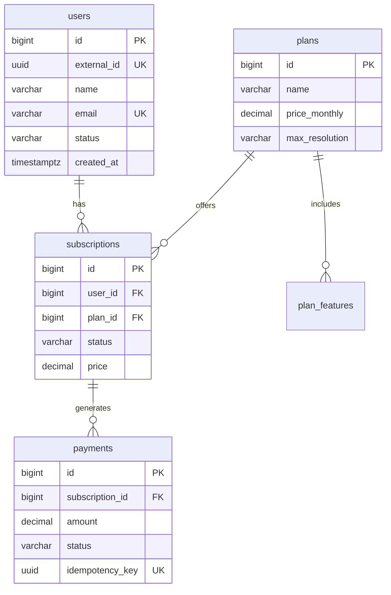

# Level 1 — Modelagem SQL & Normalização

> **Objetivo:** Dominar modelagem relacional — normalização (1NF–BCNF), convenções de naming,
> tipos de dados, constraints e as entidades transacionais da StreamX em PostgreSQL.

**Referência:** [.docs/databases/02-sql-best-practices.md](../../.docs/databases/02-sql-best-practices.md)

---

## Contexto do Domínio

Neste nível, você modelará as **entidades transacionais** da StreamX em PostgreSQL:
`users`, `plans`, `subscriptions`, `payments`. Essas entidades exigem **ACID**, integridade
referencial e constraints rigorosos.

---

## Desafios

### Desafio 1.1 — Normalização Progressiva (1NF → BCNF)

**Contexto:** A equipe recebeu uma planilha desnormalizada do legado com dados de assinaturas.
Normalize progressivamente até BCNF.

**Dado inicial — tabela desnormalizada:**

```sql
-- ❌ "God Table" do legado
CREATE TABLE legacy_subscriptions (
    user_name       VARCHAR(200),
    user_email      VARCHAR(200),
    user_document   VARCHAR(20),
    plan_name       VARCHAR(100),
    plan_price      DECIMAL(10,2),
    plan_features   VARCHAR(500),   -- "HD,4K,Downloads" (multivalorado)
    payment_method  VARCHAR(50),
    card_last_four  VARCHAR(4),
    started_at      TIMESTAMP,
    expires_at      TIMESTAMP,
    status          VARCHAR(20)
);
```

**Requisitos:**

- **1NF:** Eliminar campos multivalorados (`plan_features` → tabela separada)
- **2NF:** Remover dependências parciais (separar dados do plano dos dados do usuário)
- **3NF:** Remover dependências transitivas (preço depende do plano, não da assinatura)
- **BCNF:** Garantir que todo determinante é chave candidata
- Documentar cada passo com DDL SQL e justificativa
- Resultado final: pelo menos 4 tabelas normalizadas (`users`, `plans`, `plan_features`, `subscriptions`)

**Critérios de aceite:**

- [ ] DDL para cada forma normal (1NF, 2NF, 3NF, BCNF) com comentários
- [ ] Justificativa técnica para cada decomposição
- [ ] Diagrama ER do schema final (ASCII ou Mermaid)
- [ ] Script de migração de dados: `INSERT INTO ... SELECT FROM legacy_subscriptions`
- [ ] Testes validando integridade pós-migração (contagem, somas, constraints)

---

### Desafio 1.2 — Convenções de Naming & Data Types

**Contexto:** Padronize o schema StreamX seguindo convenções profissionais de banco de dados.

**Requisitos:**

- Aplicar convenções de naming em todo o schema:
  - Tabelas: `snake_case`, plural (`users`, `subscriptions`)
  - Colunas: `snake_case` (`created_at`, `user_id`)
  - PKs: `id` (sempre `BIGINT GENERATED ALWAYS AS IDENTITY` ou `UUID`)
  - FKs: `<entity_singular>_id` (`user_id`, `plan_id`)
  - Timestamps: sufixo `_at` (`created_at`, `updated_at`, `deleted_at`)
  - Booleans: prefixo `is_` ou `has_` (`is_active`, `has_trial`)
  - Índices: `idx_<table>_<columns>` (`idx_users_email`)
  - Constraints: `chk_<table>_<rule>`, `uq_<table>_<columns>`
- Escolher tipos de dados corretos:
  - PKs: `BIGINT` (sequencial) ou `UUID` (distribuído) — justificar a escolha
  - Valores monetários: `DECIMAL(19,4)` (nunca `FLOAT`/`DOUBLE`)
  - Timestamps: `TIMESTAMPTZ` (nunca `TIMESTAMP` sem timezone)
  - Enums: `VARCHAR` com `CHECK` constraint (não `ENUM` type — difícil de evoluir)
  - Textos curtos: `VARCHAR(N)` com limite; textos longos: `TEXT`

**DDL esperado:**

```sql
CREATE TABLE users (
    id              BIGINT GENERATED ALWAYS AS IDENTITY PRIMARY KEY,
    external_id     UUID NOT NULL DEFAULT gen_random_uuid(),
    name            VARCHAR(200) NOT NULL,
    email           VARCHAR(255) NOT NULL,
    document        VARCHAR(20) NOT NULL,
    status          VARCHAR(20) NOT NULL DEFAULT 'ACTIVE',
    is_verified     BOOLEAN NOT NULL DEFAULT FALSE,
    created_at      TIMESTAMPTZ NOT NULL DEFAULT NOW(),
    updated_at      TIMESTAMPTZ NOT NULL DEFAULT NOW(),
    deleted_at      TIMESTAMPTZ,

    CONSTRAINT uq_users_email UNIQUE (email),
    CONSTRAINT uq_users_document UNIQUE (document),
    CONSTRAINT uq_users_external_id UNIQUE (external_id),
    CONSTRAINT chk_users_status CHECK (status IN ('ACTIVE', 'INACTIVE', 'SUSPENDED', 'DELETED'))
);

CREATE TABLE plans (
    id              BIGINT GENERATED ALWAYS AS IDENTITY PRIMARY KEY,
    name            VARCHAR(100) NOT NULL,
    slug            VARCHAR(100) NOT NULL,
    price_monthly   DECIMAL(19,4) NOT NULL,
    price_annual    DECIMAL(19,4) NOT NULL,
    max_screens     INT NOT NULL DEFAULT 1,
    max_resolution  VARCHAR(10) NOT NULL DEFAULT 'HD',
    has_downloads   BOOLEAN NOT NULL DEFAULT FALSE,
    is_active       BOOLEAN NOT NULL DEFAULT TRUE,
    created_at      TIMESTAMPTZ NOT NULL DEFAULT NOW(),

    CONSTRAINT uq_plans_slug UNIQUE (slug),
    CONSTRAINT chk_plans_price_monthly CHECK (price_monthly > 0),
    CONSTRAINT chk_plans_price_annual CHECK (price_annual > 0),
    CONSTRAINT chk_plans_resolution CHECK (max_resolution IN ('SD', 'HD', 'FHD', '4K'))
);
```

**Critérios de aceite:**

- [ ] DDL completo para `users`, `plans`, `subscriptions`, `payments` com convenções aplicadas
- [ ] Justificativa: `BIGINT` vs `UUID` para PKs (trade-offs de performance e distribuição)
- [ ] Nenhum campo `FLOAT`/`DOUBLE` para valores monetários
- [ ] Todos os timestamps usam `TIMESTAMPTZ`
- [ ] Todos os enums usam `VARCHAR` + `CHECK` (não `ENUM` type)
- [ ] Comentários SQL explicando cada constraint não-trivial

---

### Desafio 1.3 — Constraints & Integridade Referencial

**Contexto:** A StreamX precisa garantir que dados inválidos nunca entrem no banco.
Implemente constraints rigorosos para todas as entidades.

**Requisitos:**

- Implementar constraints completos para `subscriptions` e `payments`:

```sql
CREATE TABLE subscriptions (
    id              BIGINT GENERATED ALWAYS AS IDENTITY PRIMARY KEY,
    external_id     UUID NOT NULL DEFAULT gen_random_uuid(),
    user_id         BIGINT NOT NULL,
    plan_id         BIGINT NOT NULL,
    status          VARCHAR(20) NOT NULL DEFAULT 'PENDING',
    billing_cycle   VARCHAR(10) NOT NULL,
    price           DECIMAL(19,4) NOT NULL,
    currency        VARCHAR(3) NOT NULL DEFAULT 'BRL',
    started_at      TIMESTAMPTZ,
    expires_at      TIMESTAMPTZ,
    cancelled_at    TIMESTAMPTZ,
    created_at      TIMESTAMPTZ NOT NULL DEFAULT NOW(),
    updated_at      TIMESTAMPTZ NOT NULL DEFAULT NOW(),

    CONSTRAINT fk_subscriptions_user FOREIGN KEY (user_id) REFERENCES users(id),
    CONSTRAINT fk_subscriptions_plan FOREIGN KEY (plan_id) REFERENCES plans(id),
    CONSTRAINT uq_subscriptions_external_id UNIQUE (external_id),
    CONSTRAINT chk_subscriptions_status CHECK (status IN ('PENDING', 'ACTIVE', 'EXPIRED', 'CANCELLED', 'SUSPENDED')),
    CONSTRAINT chk_subscriptions_billing CHECK (billing_cycle IN ('MONTHLY', 'ANNUAL')),
    CONSTRAINT chk_subscriptions_currency CHECK (currency IN ('BRL', 'USD', 'EUR')),
    CONSTRAINT chk_subscriptions_price CHECK (price > 0),
    CONSTRAINT chk_subscriptions_dates CHECK (expires_at IS NULL OR expires_at > started_at)
);

CREATE TABLE payments (
    id              BIGINT GENERATED ALWAYS AS IDENTITY PRIMARY KEY,
    external_id     UUID NOT NULL DEFAULT gen_random_uuid(),
    subscription_id BIGINT NOT NULL,
    amount          DECIMAL(19,4) NOT NULL,
    currency        VARCHAR(3) NOT NULL DEFAULT 'BRL',
    status          VARCHAR(20) NOT NULL DEFAULT 'PENDING',
    payment_method  VARCHAR(30) NOT NULL,
    idempotency_key UUID NOT NULL,
    paid_at         TIMESTAMPTZ,
    failed_at       TIMESTAMPTZ,
    created_at      TIMESTAMPTZ NOT NULL DEFAULT NOW(),

    CONSTRAINT fk_payments_subscription FOREIGN KEY (subscription_id) REFERENCES subscriptions(id),
    CONSTRAINT uq_payments_external_id UNIQUE (external_id),
    CONSTRAINT uq_payments_idempotency UNIQUE (idempotency_key),
    CONSTRAINT chk_payments_amount CHECK (amount > 0),
    CONSTRAINT chk_payments_status CHECK (status IN ('PENDING', 'COMPLETED', 'FAILED', 'REFUNDED')),
    CONSTRAINT chk_payments_method CHECK (payment_method IN ('CREDIT_CARD', 'DEBIT_CARD', 'PIX', 'BOLETO'))
);
```

- Implementar `ON DELETE` behaviors:
  - `users → subscriptions`: `ON DELETE RESTRICT` (não deletar usuário com assinaturas)
  - `plans → subscriptions`: `ON DELETE RESTRICT`
  - `subscriptions → payments`: `ON DELETE CASCADE` (deletar sub remove pagamentos)
- Implementar trigger para atualizar `updated_at` automaticamente
- Testar cada constraint com dados inválidos (deve falhar)

**Critérios de aceite:**

- [ ] DDL com constraints completos para `subscriptions` e `payments`
- [ ] `ON DELETE` behavior justificado para cada FK
- [ ] Trigger de `updated_at` funcional
- [ ] Script de teste: 10+ tentativas de INSERT inválido que devem falhar
- [ ] Idempotency key com constraint UNIQUE demonstrada

---

### Desafio 1.4 — Soft Delete & Audit Trail

**Contexto:** Na StreamX, nunca se deleta dados realmente — usa-se soft delete com
audit trail para compliance.

**Requisitos:**

- Implementar soft delete na tabela `users`:
  - Coluna `deleted_at TIMESTAMPTZ` — `NULL` = ativo, preenchido = deletado
  - Partial index para queries de usuários ativos: `WHERE deleted_at IS NULL`
  - View `active_users` que filtra automaticamente

```sql
-- Partial index: queries de ativos são otimizadas
CREATE INDEX idx_users_active_email ON users(email) WHERE deleted_at IS NULL;

-- View para abstração
CREATE VIEW active_users AS
SELECT * FROM users WHERE deleted_at IS NULL;

-- Soft delete em vez de DELETE
UPDATE users SET deleted_at = NOW(), status = 'DELETED', updated_at = NOW()
WHERE id = :id AND deleted_at IS NULL;
```

- Implementar tabela de auditoria:

```sql
CREATE TABLE audit_log (
    id              BIGINT GENERATED ALWAYS AS IDENTITY PRIMARY KEY,
    table_name      VARCHAR(100) NOT NULL,
    record_id       BIGINT NOT NULL,
    action          VARCHAR(10) NOT NULL,  -- INSERT, UPDATE, DELETE
    old_values      JSONB,
    new_values      JSONB,
    changed_by      VARCHAR(200),
    changed_at      TIMESTAMPTZ NOT NULL DEFAULT NOW(),

    CONSTRAINT chk_audit_action CHECK (action IN ('INSERT', 'UPDATE', 'DELETE'))
);
```

- Criar trigger de auditoria que registra automaticamente mudanças em `users` e `subscriptions`

**Java 25:**
```java
// Repository com soft delete
public Optional<User> findActiveById(long id) {
    try (var conn = dataSource.getConnection();
         var stmt = conn.prepareStatement(
             "SELECT * FROM users WHERE id = ? AND deleted_at IS NULL")) {
        stmt.setLong(1, id);
        var rs = stmt.executeQuery();
        return rs.next() ? Optional.of(mapUser(rs)) : Optional.empty();
    }
}

public void softDelete(long id) {
    try (var conn = dataSource.getConnection();
         var stmt = conn.prepareStatement(
             "UPDATE users SET deleted_at = NOW(), status = 'DELETED', updated_at = NOW() WHERE id = ? AND deleted_at IS NULL")) {
        stmt.setLong(1, id);
        int affected = stmt.executeUpdate();
        if (affected == 0) throw new NotFoundException("User not found or already deleted");
    }
}
```

**Go 1.26:**
```go
func (r *UserRepo) FindActiveByID(ctx context.Context, id int64) (*User, error) {
    var u User
    err := r.db.QueryRowContext(ctx,
        "SELECT id, external_id, name, email, status, created_at FROM users WHERE id = $1 AND deleted_at IS NULL", id).
        Scan(&u.ID, &u.ExternalID, &u.Name, &u.Email, &u.Status, &u.CreatedAt)
    if errors.Is(err, sql.ErrNoRows) {
        return nil, ErrNotFound
    }
    return &u, err
}

func (r *UserRepo) SoftDelete(ctx context.Context, id int64) error {
    res, err := r.db.ExecContext(ctx,
        "UPDATE users SET deleted_at = NOW(), status = 'DELETED', updated_at = NOW() WHERE id = $1 AND deleted_at IS NULL", id)
    if err != nil {
        return fmt.Errorf("soft delete user: %w", err)
    }
    rows, _ := res.RowsAffected()
    if rows == 0 {
        return ErrNotFound
    }
    return nil
}
```

**Critérios de aceite:**

- [ ] Soft delete implementado com `deleted_at` (nunca `DELETE FROM`)
- [ ] Partial index para queries de ativos
- [ ] View `active_users` funcional
- [ ] Tabela `audit_log` com trigger automático
- [ ] Audit log captura `old_values` e `new_values` como JSONB
- [ ] Repository pattern em Java e Go usando soft delete
- [ ] Testes: soft delete não perde dados, audit log registra mudanças

---

### Desafio 1.5 — Quando Desnormalizar

**Contexto:** Normalização é o padrão, mas há cenários onde desnormalizar faz sentido
para performance de leitura.

**Requisitos:**

- Identificar 2 cenários na StreamX onde desnormalizar é justificável:
  1. **Contadores pré-calculados** — `content.view_count` em vez de `SELECT COUNT(*) FROM watch_events`
  2. **Snapshot de preço** — `payments.amount` armazena o preço no momento do pagamento
     (não referencia o preço atual do plano, que pode mudar)
- Implementar desnormalização controlada com trigger:

```sql
-- Contador desnormalizado atualizado por trigger
ALTER TABLE content ADD COLUMN view_count BIGINT NOT NULL DEFAULT 0;

CREATE OR REPLACE FUNCTION increment_view_count()
RETURNS TRIGGER AS $$
BEGIN
    UPDATE content SET view_count = view_count + 1 WHERE id = NEW.content_id;
    RETURN NEW;
END;
$$ LANGUAGE plpgsql;

CREATE TRIGGER trg_increment_views
    AFTER INSERT ON viewing_history
    FOR EACH ROW EXECUTE FUNCTION increment_view_count();
```

- Documentar trade-offs: consistência do contador vs performance de leitura
- Criar uma tabela de decisão: "Desnormalizar quando..."

**Critérios de aceite:**

- [ ] 2 cenários de desnormalização identificados e justificados
- [ ] Trigger de atualização de contador funcional
- [ ] Snapshot de preço em `payments` (não depende de `plans.price_monthly`)
- [ ] Tabela de decisão: quando desnormalizar (≥ 5 critérios)
- [ ] Testes: contador se mantém consistente após INSERTs
- [ ] Documento: `decisions/01-denormalization-strategy.md`

---

### Desafio 1.6 — Schema Completo: Script de Criação

**Contexto:** Junte tudo e crie o script DDL completo das entidades transacionais da StreamX.

**Requisitos:**

- Script SQL único que cria o schema completo:
  - Tabelas: `users`, `plans`, `plan_features`, `subscriptions`, `payments`, `audit_log`
  - Todos os constraints (PK, FK, CHECK, UNIQUE)
  - Todos os índices
  - Todas as views
  - Todos os triggers
- Script deve ser **idempotente** (executar N vezes sem erro): usar `IF NOT EXISTS`
- Script deve incluir dados de seed (planos: Basic, Standard, Premium)
- Script deve ser compatível com Flyway ou golang-migrate (versionado)

**Critérios de aceite:**

- [ ] Script SQL completo e executável em PostgreSQL 17
- [ ] Idempotente: `CREATE TABLE IF NOT EXISTS`, `CREATE INDEX IF NOT EXISTS`
- [ ] Seed data para 3 planos com features
- [ ] Compatível com migration tool (Flyway `V1__create_schema.sql` ou golang-migrate `000001_create_schema.up.sql`)
- [ ] Script de rollback (`down` migration) que reverte tudo na ordem correta (FKs primeiro)
- [ ] Execução validada com `docker run postgres` + `psql`

---

### Desafio 1.7 — Diagramas e Documentação

**Contexto:** Documente o schema para que qualquer desenvolvedor entenda a modelagem.

**Requisitos:**

- Criar diagrama ER completo em Mermaid:



- Data dictionary: tabela com cada coluna, tipo, nullable, constraints, descrição
- Glossário de domínio (StreamX context)

**Critérios de aceite:**

- [ ] Diagrama ER em Mermaid renderizável
- [ ] Data dictionary com todas as colunas de todas as tabelas
- [ ] Glossário com termos de domínio (Subscription, Plan, Billing Cycle, etc.)
- [ ] Documento: `decisions/01-schema-documentation.md`
