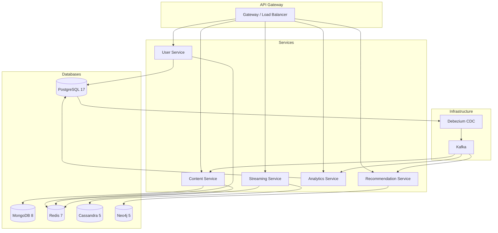

# Level 7 — Capstone: Polyglot Persistence & Integração Total

> **Objetivo:** Integrar TODOS os bancos de dados estudados em uma arquitetura polyglot
> coesa, com CDC, observabilidade, disaster recovery e documentação completa.

**Referência:**
- [.docs/databases/04-scalability-patterns.md](../../.docs/databases/04-scalability-patterns.md)
- [.docs/databases/01-database-foundations.md](../../.docs/databases/01-database-foundations.md)

---

## Contexto do Domínio

Chegou a hora de juntar tudo. A StreamX opera com 5 bancos de dados distintos,
cada um escolhido pelo seu ponto forte. Este nível integra toda a arquitetura,
garante sincronização entre bancos via CDC, implementa observabilidade end-to-end,
e documenta o disaster recovery plan.

```
                          StreamX — Polyglot Architecture
┌─────────────────────────────────────────────────────────────────────────┐
│                                                                         │
│   ┌────────────┐  ┌────────────┐  ┌────────────┐  ┌──────────────┐    │
│   │ PostgreSQL │  │  MongoDB   │  │   Redis    │  │  Cassandra   │    │
│   │            │  │            │  │            │  │              │    │
│   │ Users      │  │ Catalog    │  │ Cache L2   │  │ Watch Events │    │
│   │ Subscript. │  │ Reviews    │  │ Sessions   │  │ Daily Metrics│    │
│   │ Billing    │  │ Metadata   │  │ Rate Limit │  │              │    │
│   │ Event Store│  │            │  │ Leaderboard│  │              │    │
│   └─────┬──────┘  └─────┬──────┘  └────────────┘  └──────────────┘    │
│         │               │                                              │
│         ▼               ▼                                              │
│   ┌──────────────────────────┐         ┌────────────┐                  │
│   │    Debezium CDC          │────────▶│   Neo4j    │                  │
│   │    (Change Data Capture) │         │            │                  │
│   └──────────────────────────┘         │ Recommend. │                  │
│                                        │ Social     │                  │
│                                        └────────────┘                  │
└─────────────────────────────────────────────────────────────────────────┘
```

---

## Desafios

### Desafio 7.1 — CDC com Debezium: Sincronização Cross-Database

**Contexto:** Quando um novo assinante é criado no PostgreSQL, o Neo4j precisa de
um node `:User`, o MongoDB precisa de um document "perfil", e o Redis precisa
invalidar caches. CDC resolve isso sem dual-write.

**Requisitos:**

- Configurar Debezium connector para PostgreSQL:

```json
{
  "name": "streamx-pg-connector",
  "config": {
    "connector.class": "io.debezium.connector.postgresql.PostgresConnector",
    "database.hostname": "postgres",
    "database.port": "5432",
    "database.user": "debezium",
    "database.password": "${DEBEZIUM_PG_PASSWORD}",
    "database.dbname": "streamx",
    "database.server.name": "streamx",
    "schema.include.list": "public",
    "table.include.list": "public.users,public.subscriptions,public.content_events",
    "plugin.name": "pgoutput",
    "slot.name": "debezium_slot",
    "publication.name": "debezium_publication",

    "transforms": "route",
    "transforms.route.type": "io.debezium.transforms.ByLogicalTableRouter",
    "transforms.route.topic.regex": "streamx.public.(.*)",
    "transforms.route.topic.replacement": "streamx.cdc.$1",

    "key.converter": "org.apache.kafka.connect.json.JsonConverter",
    "value.converter": "org.apache.kafka.connect.json.JsonConverter",
    "tombstones.on.delete": true
  }
}
```

- Implementar CDC consumer que sincroniza com Neo4j:

**Java 25:**
```java
@Component
public class UserCdcConsumer {
    private final Driver neo4jDriver;
    private final RedisTemplate<String, String> redis;

    @KafkaListener(topics = "streamx.cdc.users")
    public void onUserChange(ConsumerRecord<String, String> record) {
        var payload = parseDebeziumPayload(record.value());
        var op = payload.op(); // "c" = create, "u" = update, "d" = delete

        switch (op) {
            case "c" -> {
                // Novo user → criar node no Neo4j
                var after = payload.after();
                try (var session = neo4jDriver.session()) {
                    session.executeWrite(tx -> tx.run("""
                        CREATE (:User {
                            id: $id, name: $name, email: $email,
                            plan: $plan, createdAt: datetime($createdAt)
                        })""",
                        Map.of(
                            "id", after.get("id"),
                            "name", after.get("name"),
                            "email", after.get("email"),
                            "plan", after.get("plan"),
                            "createdAt", after.get("created_at")
                        )
                    ));
                }
            }
            case "u" -> {
                // Update → atualizar Neo4j + invalidar cache Redis
                var after = payload.after();
                try (var session = neo4jDriver.session()) {
                    session.executeWrite(tx -> tx.run("""
                        MATCH (u:User {id: $id})
                        SET u.name = $name, u.plan = $plan""",
                        Map.of("id", after.get("id"),
                               "name", after.get("name"),
                               "plan", after.get("plan"))
                    ));
                }
                redis.delete("user:" + after.get("id"));
            }
            case "d" -> {
                // Delete → remover de Neo4j + invalidar cache
                var before = payload.before();
                try (var session = neo4jDriver.session()) {
                    session.executeWrite(tx -> tx.run(
                        "MATCH (u:User {id: $id}) DETACH DELETE u",
                        Map.of("id", before.get("id"))
                    ));
                }
                redis.delete("user:" + before.get("id"));
            }
        }
    }
}
```

**Go 1.26:**
```go
func (c *UserCDCConsumer) ProcessMessage(ctx context.Context, msg kafka.Message) error {
    var payload DebeziumPayload
    if err := json.Unmarshal(msg.Value, &payload); err != nil {
        return fmt.Errorf("unmarshal CDC: %w", err)
    }

    switch payload.Op {
    case "c":
        _, err := neo4j.ExecuteQuery(ctx, c.neo4jDriver,
            `CREATE (:User {id: $id, name: $name, plan: $plan, createdAt: datetime($createdAt)})`,
            map[string]any{
                "id":        payload.After["id"],
                "name":      payload.After["name"],
                "plan":      payload.After["plan"],
                "createdAt": payload.After["created_at"],
            },
            neo4j.WithWriteAccess(),
        )
        return err

    case "u":
        _, err := neo4j.ExecuteQuery(ctx, c.neo4jDriver,
            `MATCH (u:User {id: $id}) SET u.name = $name, u.plan = $plan`,
            map[string]any{
                "id":   payload.After["id"],
                "name": payload.After["name"],
                "plan": payload.After["plan"],
            },
            neo4j.WithWriteAccess(),
        )
        if err != nil { return err }
        return c.redis.Del(ctx, "user:"+payload.After["id"].(string)).Err()

    case "d":
        _, err := neo4j.ExecuteQuery(ctx, c.neo4jDriver,
            `MATCH (u:User {id: $id}) DETACH DELETE u`,
            map[string]any{"id": payload.Before["id"]},
            neo4j.WithWriteAccess(),
        )
        if err != nil { return err }
        return c.redis.Del(ctx, "user:"+payload.Before["id"].(string)).Err()
    }
    return nil
}
```

**Critérios de aceite:**

- [ ] Debezium connector configurado para PostgreSQL (pgoutput)
- [ ] CDC consumer processa CREATE, UPDATE, DELETE
- [ ] Neo4j sincronizado via CDC (sem dual-write)
- [ ] Redis cache invalidado automaticamente via CDC
- [ ] Idempotência: re-processar mensagem não duplica dados
- [ ] Diagrama: fluxo PG → Kafka → consumers (Neo4j, Redis, MongoDB)

---

### Desafio 7.2 — Observabilidade Cross-Database

**Contexto:** Com 5 bancos diferentes, observabilidade unificada é essencial.
Métricas, health checks e alertas precisam cobrir todos os databases.

**Requisitos:**

- Implementar health check agregado:

**Java 25:**
```java
public record DatabaseClusterHealth(
    Instant checkedAt,
    boolean allHealthy,
    Map<String, DatabaseHealth> databases
) {
    public static DatabaseClusterHealth check(
            DataSource postgres,
            MongoClient mongo,
            JedisPool redis,
            CqlSession cassandra,
            Driver neo4j) {

        var checks = Map.of(
            "postgresql", checkPostgres(postgres),
            "mongodb", checkMongo(mongo),
            "redis", checkRedis(redis),
            "cassandra", checkCassandra(cassandra),
            "neo4j", checkNeo4j(neo4j)
        );

        boolean allHealthy = checks.values().stream()
            .allMatch(DatabaseHealth::healthy);

        return new DatabaseClusterHealth(Instant.now(), allHealthy, checks);
    }

    private static DatabaseHealth checkPostgres(DataSource ds) {
        var start = Instant.now();
        try (var conn = ds.getConnection()) {
            conn.createStatement().execute("SELECT 1");
            return new DatabaseHealth("postgresql", true,
                Duration.between(start, Instant.now()), null);
        } catch (Exception e) {
            return new DatabaseHealth("postgresql", false, Duration.ZERO, e.getMessage());
        }
    }

    private static DatabaseHealth checkMongo(MongoClient client) {
        var start = Instant.now();
        try {
            client.getDatabase("streamx").runCommand(new Document("ping", 1));
            return new DatabaseHealth("mongodb", true,
                Duration.between(start, Instant.now()), null);
        } catch (Exception e) {
            return new DatabaseHealth("mongodb", false, Duration.ZERO, e.getMessage());
        }
    }

    private static DatabaseHealth checkRedis(JedisPool pool) {
        var start = Instant.now();
        try (var jedis = pool.getResource()) {
            jedis.ping();
            return new DatabaseHealth("redis", true,
                Duration.between(start, Instant.now()), null);
        } catch (Exception e) {
            return new DatabaseHealth("redis", false, Duration.ZERO, e.getMessage());
        }
    }

    private static DatabaseHealth checkCassandra(CqlSession session) {
        var start = Instant.now();
        try {
            session.execute("SELECT now() FROM system.local");
            return new DatabaseHealth("cassandra", true,
                Duration.between(start, Instant.now()), null);
        } catch (Exception e) {
            return new DatabaseHealth("cassandra", false, Duration.ZERO, e.getMessage());
        }
    }

    private static DatabaseHealth checkNeo4j(Driver driver) {
        var start = Instant.now();
        try {
            driver.verifyConnectivity();
            return new DatabaseHealth("neo4j", true,
                Duration.between(start, Instant.now()), null);
        } catch (Exception e) {
            return new DatabaseHealth("neo4j", false, Duration.ZERO, e.getMessage());
        }
    }
}

public record DatabaseHealth(String name, boolean healthy, Duration latency, String error) {}
```

**Go 1.26:**
```go
type ClusterHealth struct {
    CheckedAt  time.Time                  `json:"checkedAt"`
    AllHealthy bool                       `json:"allHealthy"`
    Databases  map[string]DatabaseHealth  `json:"databases"`
}

type DatabaseHealth struct {
    Name    string        `json:"name"`
    Healthy bool          `json:"healthy"`
    Latency time.Duration `json:"latency"`
    Error   string        `json:"error,omitempty"`
}

func CheckCluster(ctx context.Context, deps Dependencies) ClusterHealth {
    var mu sync.Mutex
    health := ClusterHealth{
        CheckedAt: time.Now(),
        Databases: make(map[string]DatabaseHealth),
    }

    var g errgroup.Group

    checks := []struct {
        name string
        fn   func(context.Context) error
    }{
        {"postgresql", func(ctx context.Context) error { return deps.PG.PingContext(ctx) }},
        {"mongodb", func(ctx context.Context) error { return deps.Mongo.Ping(ctx, nil) }},
        {"redis", func(ctx context.Context) error { return deps.Redis.Ping(ctx).Err() }},
        {"cassandra", func(ctx context.Context) error {
            return deps.Cassandra.Query("SELECT now() FROM system.local").WithContext(ctx).Exec()
        }},
        {"neo4j", func(ctx context.Context) error { return deps.Neo4j.VerifyConnectivity(ctx) }},
    }

    for _, c := range checks {
        c := c
        g.Go(func() error {
            start := time.Now()
            err := c.fn(ctx)
            dh := DatabaseHealth{Name: c.name, Latency: time.Since(start)}
            if err != nil {
                dh.Error = err.Error()
            } else {
                dh.Healthy = true
            }
            mu.Lock()
            health.Databases[c.name] = dh
            mu.Unlock()
            return nil // don't short-circuit other checks
        })
    }
    g.Wait()

    health.AllHealthy = true
    for _, dh := range health.Databases {
        if !dh.Healthy {
            health.AllHealthy = false
            break
        }
    }
    return health
}
```

- Dashboard de métricas (tabela de alertas):

```
┌─────────────────┬──────────────────────────────┬──────────┬──────────┐
│ Database        │ Métrica                      │ Warning  │ Critical │
├─────────────────┼──────────────────────────────┼──────────┼──────────┤
│ PostgreSQL      │ Active connections           │ > 120    │ > 180    │
│ PostgreSQL      │ Replication lag (seconds)     │ > 5      │ > 30     │
│ PostgreSQL      │ Cache hit ratio              │ < 98%    │ < 95%    │
│ PostgreSQL      │ Dead tuples ratio            │ > 5%     │ > 10%    │
├─────────────────┼──────────────────────────────┼──────────┼──────────┤
│ MongoDB         │ Page faults/second           │ > 100    │ > 500    │
│ MongoDB         │ Replication lag (seconds)     │ > 10     │ > 60     │
│ MongoDB         │ Connections used %           │ > 70%    │ > 90%    │
├─────────────────┼──────────────────────────────┼──────────┼──────────┤
│ Redis           │ Memory used vs maxmemory     │ > 70%    │ > 90%    │
│ Redis           │ Evicted keys/second          │ > 10     │ > 100    │
│ Redis           │ Connected clients            │ > 100    │ > 120    │
├─────────────────┼──────────────────────────────┼──────────┼──────────┤
│ Cassandra       │ Read latency p99 (ms)        │ > 50     │ > 200    │
│ Cassandra       │ Tombstone warnings           │ > 100/h  │ > 1000/h │
│ Cassandra       │ Pending compactions          │ > 10     │ > 50     │
├─────────────────┼──────────────────────────────┼──────────┼──────────┤
│ Neo4j           │ Query plan cache misses      │ > 10%    │ > 30%    │
│ Neo4j           │ Page cache hit ratio         │ < 95%    │ < 80%    │
│ Neo4j           │ Active transactions          │ > 50     │ > 100    │
└─────────────────┴──────────────────────────────┴──────────┴──────────┘
```

**Critérios de aceite:**

- [ ] Health check para 5 databases implementado (paralelo)
- [ ] Endpoint `/health/databases` retorna status agregado
- [ ] Tabela de alertas com thresholds warning/critical para cada DB
- [ ] Health check com timeout (não bloquear se DB estiver down)
- [ ] Resposta em JSON com latência de cada database
- [ ] Go: checks em paralelo com `errgroup`

---

### Desafio 7.3 — Disaster Recovery: RPO/RTO por Workload

**Contexto:** Cada banco tem criticidade diferente. O DR plan precisa ser
proporcional ao impacto de cada perda.

**Requisitos:**

- Definir RPO/RTO por dado:

```
┌───────────────┬──────────────────┬──────┬──────┬───────────────────────────┐
│ Dado          │ Database         │ RPO  │ RTO  │ Estratégia                │
├───────────────┼──────────────────┼──────┼──────┼───────────────────────────┤
│ Users/Billing │ PostgreSQL       │ 0    │ 1min │ Sync replication +        │
│               │                  │      │      │ auto failover (Patroni)   │
├───────────────┼──────────────────┼──────┼──────┼───────────────────────────┤
│ Subscriptions │ PostgreSQL       │ 0    │ 1min │ Mesmo cluster do billing  │
├───────────────┼──────────────────┼──────┼──────┼───────────────────────────┤
│ Catalog       │ MongoDB          │ 5min │ 5min │ Replica set (3 nodes)     │
│               │                  │      │      │ + point-in-time backup    │
├───────────────┼──────────────────┼──────┼──────┼───────────────────────────┤
│ Cache/Session │ Redis            │ N/A  │ 0    │ Rebuild automático do     │
│               │                  │      │      │ source of truth           │
├───────────────┼──────────────────┼──────┼──────┼───────────────────────────┤
│ Watch Events  │ Cassandra        │ 1h   │ 15min│ Multi-DC replication      │
│               │                  │      │      │ (eventual consistency)    │
├───────────────┼──────────────────┼──────┼──────┼───────────────────────────┤
│ Recommend.    │ Neo4j            │ 1h   │ 30min│ Offline backup +          │
│ Graph         │                  │      │      │ rebuild from CDC events   │
└───────────────┴──────────────────┴──────┴──────┴───────────────────────────┘
```

- Implementar scripts de backup e restore:

```bash
#!/bin/bash
# backup-all-databases.sh — Backup orquestrado de todos os bancos

set -euo pipefail
BACKUP_DIR="/backups/$(date +%Y%m%d_%H%M%S)"
mkdir -p "$BACKUP_DIR"

echo "=== StreamX Full Backup ==="
echo "Timestamp: $(date -u +%Y-%m-%dT%H:%M:%SZ)"

# 1. PostgreSQL (pg_dump com formato custom para restore paralelo)
echo "[1/4] PostgreSQL..."
pg_dump -h "$PG_HOST" -U "$PG_USER" -d streamx \
    -F c -j 4 -f "$BACKUP_DIR/postgresql.dump"
echo "  ✓ PostgreSQL: $(du -sh "$BACKUP_DIR/postgresql.dump" | cut -f1)"

# 2. MongoDB (mongodump com oplog para point-in-time)
echo "[2/4] MongoDB..."
mongodump --host "$MONGO_HOST" --db streamx \
    --oplog --gzip --out "$BACKUP_DIR/mongodb/"
echo "  ✓ MongoDB: $(du -sh "$BACKUP_DIR/mongodb/" | cut -f1)"

# 3. Cassandra (snapshot via nodetool)
echo "[3/4] Cassandra..."
nodetool -h "$CASSANDRA_HOST" snapshot -t "$BACKUP_DIR" streamx
echo "  ✓ Cassandra: snapshot created"

# 4. Neo4j (neo4j-admin dump)
echo "[4/4] Neo4j..."
neo4j-admin database dump neo4j --to-path="$BACKUP_DIR/neo4j/"
echo "  ✓ Neo4j: $(du -sh "$BACKUP_DIR/neo4j/" | cut -f1)"

# Redis: não faz backup (cache é efêmero)
echo "[skip] Redis: cache é reconstruído automaticamente"

echo "=== Backup completo: $BACKUP_DIR ==="
echo "Total size: $(du -sh "$BACKUP_DIR" | cut -f1)"
```

- Implementar restore com validação:

```bash
#!/bin/bash
# restore-postgresql.sh — Restore com validação

set -euo pipefail
BACKUP_FILE="$1"

echo "=== PostgreSQL Restore ==="

# 1. Restore
pg_restore -h "$PG_HOST" -U "$PG_USER" -d streamx \
    -j 4 --clean --if-exists "$BACKUP_FILE"

# 2. Validação
EXPECTED_TABLES=("users" "subscriptions" "payments" "content_events")
for table in "${EXPECTED_TABLES[@]}"; do
    count=$(psql -h "$PG_HOST" -U "$PG_USER" -d streamx -t \
        -c "SELECT count(*) FROM $table;")
    echo "  ✓ $table: $count rows"
done

echo "=== Restore completo e validado ==="
```

- Runbook de failover para PostgreSQL (Patroni):

```
## Runbook: PostgreSQL Failover

### Pré-condições
- [ ] Patroni cluster com 1 primary + 2 replicas
- [ ] HAProxy ou PgBouncer apontando para primary via Patroni API

### Failover automático (Patroni detecta)
1. Patroni detecta primary down
2. Replica com menor lag é promovida (< 30 segundos)
3. HAProxy redireciona tráfego para novo primary
4. CDC (Debezium) reconecta automaticamente ao novo primary

### Failover manual (manutenção)
1. Verificar lag: `patronictl list`
2. Switchover: `patronictl switchover --master-node pg-primary --candidate pg-replica-1`
3. Verificar: `patronictl list` (novo primary deve aparecer como Leader)
4. Testar: `psql -c "SELECT pg_is_in_recovery()"` → false no novo primary
```

**Critérios de aceite:**

- [ ] RPO/RTO definido para todos os 5 databases
- [ ] Script de backup para PG, Mongo, Cassandra, Neo4j
- [ ] Script de restore com validação (row counts)
- [ ] Runbook de failover para PostgreSQL
- [ ] Redis explicitamente excluído de backup (com justificativa)
- [ ] Documento: `decisions/07-disaster-recovery-plan.md`

---

### Desafio 7.4 — Docker Compose: Ambiente Polyglot Completo

**Contexto:** Para desenvolvimento e testes, a equipe precisa de um `docker-compose.yml`
que suba toda a infraestrutura de dados.

**Requisitos:**

- Criar `docker-compose.yml` com todos os databases:

```yaml
version: "3.9"

services:
  # ── PostgreSQL 17 (Users, Billing, Event Store) ──
  postgres:
    image: postgres:17-alpine
    environment:
      POSTGRES_DB: streamx
      POSTGRES_USER: streamx
      POSTGRES_PASSWORD: ${PG_PASSWORD:-streamx_dev}
    ports: ["5432:5432"]
    volumes:
      - pg_data:/var/lib/postgresql/data
      - ./init/postgres:/docker-entrypoint-initdb.d
    command: >
      postgres
        -c wal_level=logical
        -c max_replication_slots=4
        -c max_wal_senders=4
    healthcheck:
      test: ["CMD-SHELL", "pg_isready -U streamx"]
      interval: 10s
      timeout: 5s
      retries: 5

  # ── MongoDB 8 (Content Catalog) ──
  mongodb:
    image: mongo:8.0
    environment:
      MONGO_INITDB_DATABASE: streamx
    ports: ["27017:27017"]
    volumes:
      - mongo_data:/data/db
      - ./init/mongodb:/docker-entrypoint-initdb.d
    healthcheck:
      test: ["CMD", "mongosh", "--eval", "db.adminCommand('ping')"]
      interval: 10s
      timeout: 5s
      retries: 5

  # ── Redis 7 (Cache, Sessions, Leaderboard) ──
  redis:
    image: redis:7-alpine
    ports: ["6379:6379"]
    command: redis-server --maxmemory 256mb --maxmemory-policy allkeys-lru
    volumes:
      - redis_data:/data
    healthcheck:
      test: ["CMD", "redis-cli", "ping"]
      interval: 5s
      timeout: 3s
      retries: 5

  # ── Cassandra 5 (Watch Events) ──
  cassandra:
    image: cassandra:5.0
    environment:
      CASSANDRA_CLUSTER_NAME: streamx_cluster
      CASSANDRA_DC: dc1
    ports: ["9042:9042"]
    volumes:
      - cassandra_data:/var/lib/cassandra
      - ./init/cassandra:/docker-entrypoint-initdb.d
    healthcheck:
      test: ["CMD-SHELL", "cqlsh -e 'DESCRIBE KEYSPACES'"]
      interval: 30s
      timeout: 10s
      retries: 10
      start_period: 60s

  # ── Neo4j 5 (Recommendations Graph) ──
  neo4j:
    image: neo4j:5-community
    environment:
      NEO4J_AUTH: neo4j/${NEO4J_PASSWORD:-streamx_dev}
      NEO4J_PLUGINS: '["apoc"]'
    ports:
      - "7474:7474"  # HTTP
      - "7687:7687"  # Bolt
    volumes:
      - neo4j_data:/data
      - ./init/neo4j:/var/lib/neo4j/import
    healthcheck:
      test: ["CMD", "cypher-shell", "-u", "neo4j", "-p", "streamx_dev", "RETURN 1"]
      interval: 15s
      timeout: 10s
      retries: 10

  # ── Kafka + Zookeeper (CDC Event Bus) ──
  zookeeper:
    image: confluentinc/cp-zookeeper:7.6.0
    environment:
      ZOOKEEPER_CLIENT_PORT: 2181
    ports: ["2181:2181"]

  kafka:
    image: confluentinc/cp-kafka:7.6.0
    depends_on: [zookeeper]
    ports: ["9092:9092"]
    environment:
      KAFKA_BROKER_ID: 1
      KAFKA_ZOOKEEPER_CONNECT: zookeeper:2181
      KAFKA_ADVERTISED_LISTENERS: PLAINTEXT://kafka:29092,HOST://localhost:9092
      KAFKA_LISTENER_SECURITY_PROTOCOL_MAP: PLAINTEXT:PLAINTEXT,HOST:PLAINTEXT
      KAFKA_INTER_BROKER_LISTENER_NAME: PLAINTEXT
      KAFKA_OFFSETS_TOPIC_REPLICATION_FACTOR: 1

  # ── Debezium Connect (CDC) ──
  debezium:
    image: debezium/connect:2.6
    depends_on: [kafka, postgres]
    ports: ["8083:8083"]
    environment:
      BOOTSTRAP_SERVERS: kafka:29092
      GROUP_ID: streamx-connect
      CONFIG_STORAGE_TOPIC: _connect-configs
      OFFSET_STORAGE_TOPIC: _connect-offsets
      STATUS_STORAGE_TOPIC: _connect-status

volumes:
  pg_data:
  mongo_data:
  redis_data:
  cassandra_data:
  neo4j_data:
```

- Criar scripts de inicialização (`init/`):

```
init/
├── postgres/
│   └── 01-schema.sql          # DDL: users, subscriptions, payments, events
├── mongodb/
│   └── 01-init.js             # Collections + validation + indexes
├── cassandra/
│   └── 01-schema.cql          # Keyspace + tables com compaction/TTL
└── neo4j/
    └── seed.cypher            # Nodes + relationships iniciais
```

**Critérios de aceite:**

- [ ] `docker compose up` sobe 7 containers (PG, Mongo, Redis, Cassandra, Neo4j, Kafka, Debezium)
- [ ] Health checks para todos os databases
- [ ] Volumes persistentes para dados
- [ ] Scripts de inicialização por database
- [ ] PostgreSQL com `wal_level=logical` (requisito do Debezium)
- [ ] Redis com maxmemory e eviction policy
- [ ] Cassandra com start_period longo (bootup lento)
- [ ] Documento: `README-local-setup.md`

---

### Desafio 7.5 — Teste de Integração End-to-End

**Contexto:** Teste que valida o fluxo completo: criar user → assinar plano →
assistir conteúdo → gerar recomendação → verificar dados em todos os bancos.

**Requisitos:**

- Implementar teste E2E em Java e Go:

**Java 25 (Testcontainers):**
```java
@Testcontainers
class PolyglotIntegrationTest {

    @Container
    static PostgreSQLContainer<?> postgres = new PostgreSQLContainer<>("postgres:17-alpine")
        .withDatabaseName("streamx");

    @Container
    static MongoDBContainer mongo = new MongoDBContainer("mongo:8.0");

    @Container
    static GenericContainer<?> redis = new GenericContainer<>("redis:7-alpine")
        .withExposedPorts(6379);

    @Test
    void fullUserJourney() {
        // 1. Criar usuário (PostgreSQL)
        var userId = userService.createUser(new CreateUserCmd("Alice", "alice@test.com"));
        assertThat(userId).isNotNull();

        // 2. Criar assinatura (PostgreSQL)
        var subId = subscriptionService.subscribe(userId, "PREMIUM");
        assertThat(subId).isNotNull();

        // 3. Adicionar conteúdo ao catálogo (MongoDB)
        var contentId = catalogService.addContent(new ContentCmd(
            "Interstellar", "MOVIE", List.of("Sci-Fi", "Drama"),
            Map.of("duration_minutes", 169, "release_year", 2014)
        ));
        assertThat(contentId).isNotNull();

        // 4. Registrar visualização (Cassandra → via service)
        watchService.recordEvent(new WatchEventCmd(
            userId, contentId, "PLAY", 0, "TV", "4K"
        ));
        watchService.recordEvent(new WatchEventCmd(
            userId, contentId, "STOP", 5400000, "TV", "4K" // 90 min
        ));

        // 5. Verificar progresso
        var progress = watchService.getProgress(userId, contentId);
        assertThat(progress.positionMs()).isEqualTo(5400000L);

        // 6. Verificar cache (Redis)
        var cached = cacheService.get("content:" + contentId);
        assertThat(cached).isNotNull();

        // 7. Verificar no read model (MongoDB — via CQRS projection)
        var userView = queryService.getUserProfile(userId);
        assertThat(userView.plan()).isEqualTo("PREMIUM");
        assertThat(userView.totalWatchTimeMs()).isGreaterThan(0);
    }
}
```

**Go 1.26 (Testcontainers):**
```go
func TestPolyglotIntegration(t *testing.T) {
    ctx := context.Background()

    // Setup containers
    pgC, _ := postgres.Run(ctx, "postgres:17-alpine",
        postgres.WithDatabase("streamx"))
    defer pgC.Terminate(ctx)

    mongoC, _ := mongodb.Run(ctx, "mongo:8.0")
    defer mongoC.Terminate(ctx)

    redisC, _ := rediscontainer.Run(ctx, "redis:7-alpine")
    defer redisC.Terminate(ctx)

    // Initialize services with container endpoints
    deps := setupDependencies(ctx, pgC, mongoC, redisC)
    defer deps.Close()

    // 1. Create user
    userID, err := deps.UserService.Create(ctx, CreateUserCmd{
        Name: "Alice", Email: "alice@test.com",
    })
    require.NoError(t, err)

    // 2. Subscribe
    subID, err := deps.SubscriptionService.Subscribe(ctx, userID, "PREMIUM")
    require.NoError(t, err)
    require.NotEmpty(t, subID)

    // 3. Add content (MongoDB)
    contentID, err := deps.CatalogService.Add(ctx, ContentCmd{
        Title: "Interstellar", Type: "MOVIE",
        Genres: []string{"Sci-Fi", "Drama"},
    })
    require.NoError(t, err)

    // 4. Record watch (PostgreSQL event store or Cassandra)
    err = deps.WatchService.RecordEvent(ctx, WatchEventCmd{
        UserID: userID, ContentID: contentID,
        EventType: "PLAY", PositionMs: 0,
    })
    require.NoError(t, err)

    // 5. Verify data consistency across databases
    user, _ := deps.UserService.Get(ctx, userID)
    assert.Equal(t, "Alice", user.Name)

    content, _ := deps.CatalogService.Get(ctx, contentID)
    assert.Equal(t, "Interstellar", content.Title)

    t.Log("✅ Polyglot integration test passed")
}
```

**Critérios de aceite:**

- [ ] Teste E2E cobre 5+ databases no mesmo fluxo
- [ ] Testcontainers para spin up/down automático
- [ ] Fluxo: Create User → Subscribe → Add Content → Watch → Verify
- [ ] Verificação de dados em pelo menos 3 databases diferentes
- [ ] Teste roda em CI (Docker-in-Docker ou Testcontainers Cloud)
- [ ] Tempo de execução documentado (< 2 minutos com imagens em cache)

---

### Desafio 7.6 — Documentação Arquitetural Final

**Contexto:** Documente a arquitetura polyglot completa da StreamX como referência
para a equipe e futuros membros.

**Requisitos:**

- Criar Architecture Decision Records (ADRs):

```
decisions/
├── 00-adr-template.md
├── 01-polyglot-persistence.md      # Por que 5 bancos diferentes
├── 02-postgresql-for-transactions.md
├── 03-mongodb-for-catalog.md
├── 04-redis-for-caching.md
├── 05-cassandra-for-events.md
├── 06-neo4j-for-recommendations.md
├── 07-cdc-over-dual-write.md       # Debezium vs dual-write
├── 08-cqrs-for-read-optimization.md
├── 09-event-sourcing-for-audit.md
└── 10-disaster-recovery-strategy.md
```

- Cada ADR segue o template Nygard:

```markdown
# ADR-001: Polyglot Persistence Architecture

## Status
Accepted

## Context
A StreamX precisa armazenar dados com características muito diferentes:
dados transacionais (ACID), catálogo flexível, cache de alta velocidade,
eventos high-throughput, e grafos de relacionamentos.

## Decision
Adotar arquitetura polyglot com 5 databases:
- PostgreSQL 17: transações, billing, event store
- MongoDB 8: catálogo de conteúdo
- Redis 7: cache, sessões, rate limiting
- Cassandra 5: watch events (time-series)
- Neo4j 5: recomendações (graph)

## Consequences
### Positivas
- Cada banco otimizado para seu workload
- Escalabilidade independente por tipo de dado
- Melhor performance (right tool for the job)

### Negativas
- Complexidade operacional (5 bancos para gerenciar)
- Necessidade de CDC para sincronização
- Equipe precisa dominar 5 tecnologias
- Eventual consistency entre bancos

### Mitigações
- Docker Compose para ambiente local
- CDC com Debezium para sincronização
- Documentação e runbooks por database
- Gradual adoption (começar com PG, adicionar incrementalmente)
```

- Criar diagrama final com Mermaid:



- Tabela resumo de decisões:

```
┌──────────────────┬─────────────┬──────────────────┬───────────────────┐
│ Dado             │ Database    │ Justificativa     │ Alternativa       │
│                  │             │ Principal         │ Descartada        │
├──────────────────┼─────────────┼──────────────────┼───────────────────┤
│ Users/Billing    │ PostgreSQL  │ ACID, FK,        │ MySQL (menos      │
│                  │             │ constraints       │ features avançad.)│
├──────────────────┼─────────────┼──────────────────┼───────────────────┤
│ Content Catalog  │ MongoDB     │ Schema flexível, │ PostgreSQL JSONB  │
│                  │             │ aggregation       │ (menos natural)   │
├──────────────────┼─────────────┼──────────────────┼───────────────────┤
│ Cache/Sessions   │ Redis       │ Sub-ms latência, │ Memcached (menos  │
│                  │             │ data structures   │ data types)       │
├──────────────────┼─────────────┼──────────────────┼───────────────────┤
│ Watch Events     │ Cassandra   │ Linear scaling,  │ TimescaleDB       │
│                  │             │ high write throughput│ (se < 50K w/s) │
├──────────────────┼─────────────┼──────────────────┼───────────────────┤
│ Recommendations  │ Neo4j       │ Graph traversal, │ PostgreSQL        │
│                  │             │ pattern matching  │ recursive CTEs    │
│                  │             │                   │ (performance)     │
├──────────────────┼─────────────┼──────────────────┼───────────────────┤
│ Synchronization  │ Debezium    │ CDC, no dual-    │ Application-level │
│                  │ + Kafka     │ write, reliable   │ events (unreliable│
│                  │             │                   │ if app crashes)   │
└──────────────────┴─────────────┴──────────────────┴───────────────────┘
```

**Critérios de aceite:**

- [ ] 10 ADRs criados seguindo template Nygard
- [ ] Diagrama Mermaid com todos os serviços e databases
- [ ] Tabela resumo: dado → database → justificativa → alternativa descartada
- [ ] README.md do projeto com Getting Started (docker compose up)
- [ ] Contribuição guide: como adicionar novo database ao ecossistema
- [ ] Retrospectiva: 3 coisas que funcionaram bem + 3 melhorias
